# 认证服务 (Auth Service) 文档

## 1. 系统架构图

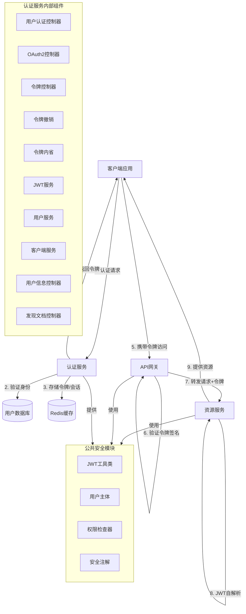
```mermaid
graph TD
    Client[客户端应用] -->|1. 认证请求| AuthService[认证服务]
    AuthService -->|2. 验证身份| UserDB[(用户数据库)]
    AuthService -->|3. 存储令牌/会话| RedisCache[(Redis缓存)]
    AuthService -->|4. 返回令牌| Client
    Client -->|5. 携带令牌访问| Gateway[API网关]
    Gateway -->|6. 验证令牌签名| Gateway
    Gateway -->|7. 转发请求+令牌| ResourceService[资源服务]
    ResourceService -->|8. JWT自解析| ResourceService
    ResourceService -->|9. 提供资源| Client
    
    subgraph 认证服务内部组件
        AuthController[用户认证控制器]
        OAuth2Controller[OAuth2控制器]
        TokenController[令牌控制器]
        TokenRevokeController[令牌撤销]
        TokenIntrospectionController[令牌内省]
        JwtService[JWT服务]
        UserService[用户服务]
        ClientService[客户端服务]
        UserInfoController[用户信息控制器]
        DiscoveryController[发现文档控制器]
    end
    
    subgraph 公共安全模块
        JwtUtils[JWT工具类]
        UserPrincipal[用户主体]
        PermissionChecker[权限检查器]
        SecurityAnnotations[安全注解]
    end
    
    ResourceService -->|使用| 公共安全模块
    Gateway -->|使用| 公共安全模块
    AuthService -->|提供| 公共安全模块
```

## 2. 服务概述

### 2.1 认证服务定位

认证服务是整个系统的安全基础设施，提供统一的身份认证和授权管理。该服务实现了完整的 OAuth 2.0 规范，并扩展支持 OpenID Connect (OIDC) 标准，实现了身份验证与授权的分离，为微服务架构提供统一的安全解决方案。

### 2.2 认证流程图

#### OAuth 2.0 基本流程

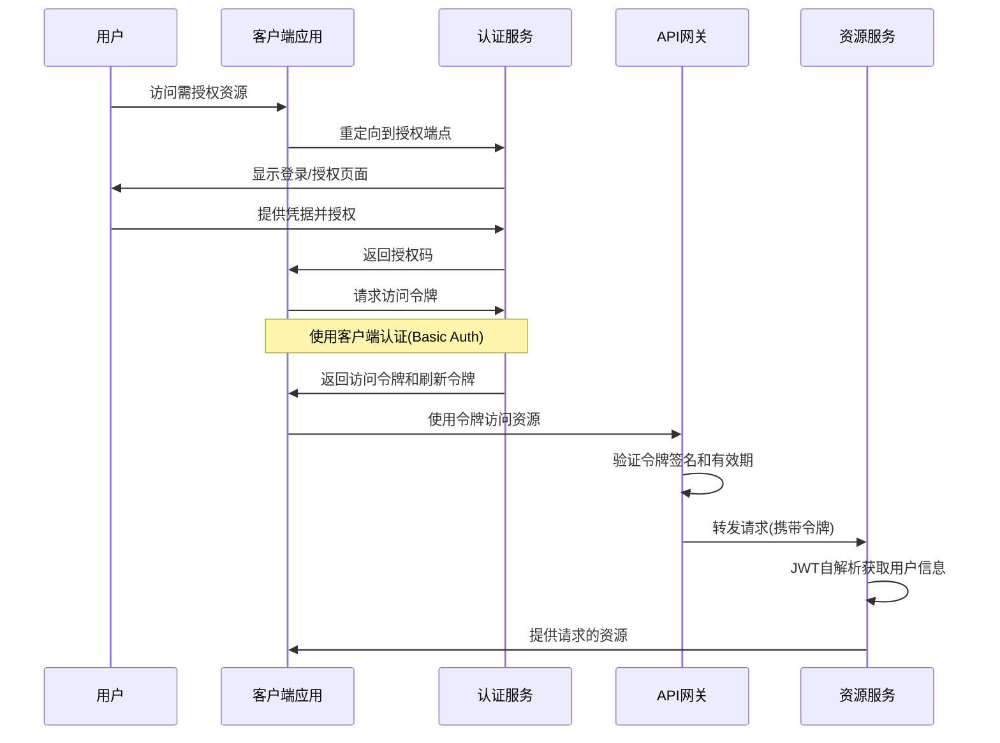
```mermaid
sequenceDiagram
    participant User as 用户
    participant Client as 客户端应用
    participant Auth as 认证服务
    participant Gateway as API网关
    participant Resource as 资源服务
    
    User->>Client: 访问需授权资源
    Client->>Auth: 重定向到授权端点
    Auth->>User: 显示登录/授权页面
    User->>Auth: 提供凭据并授权
    Auth->>Client: 返回授权码
    Client->>Auth: 请求访问令牌
    Note over Client,Auth: 使用客户端认证(Basic Auth)
    Auth->>Client: 返回访问令牌和刷新令牌
    Client->>Gateway: 使用令牌访问资源
    Gateway->>Gateway: 验证令牌签名和有效期
    Gateway->>Resource: 转发请求(携带令牌)
    Resource->>Resource: JWT自解析获取用户信息
    Resource->>Client: 提供请求的资源
```

#### OpenID Connect 流程 (新增)

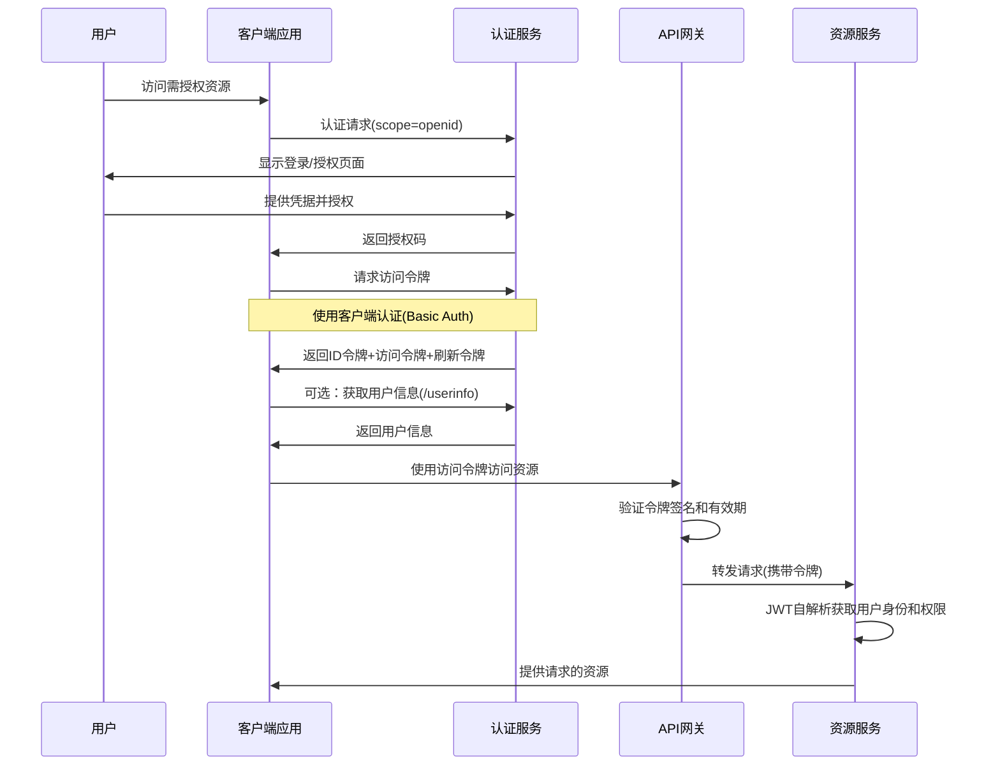
```mermaid
sequenceDiagram
    participant User as 用户
    participant Client as 客户端应用
    participant Auth as 认证服务
    participant Gateway as API网关
    participant Resource as 资源服务
    
    User->>Client: 访问需授权资源
    Client->>Auth: 认证请求(scope=openid)
    Auth->>User: 显示登录/授权页面
    User->>Auth: 提供凭据并授权
    Auth->>Client: 返回授权码
    Client->>Auth: 请求访问令牌
    Note over Client,Auth: 使用客户端认证(Basic Auth)
    Auth->>Client: 返回ID令牌+访问令牌+刷新令牌
    Client->>Auth: 可选：获取用户信息(/userinfo)
    Auth->>Client: 返回用户信息
    Client->>Gateway: 使用访问令牌访问资源
    Gateway->>Gateway: 验证令牌签名和有效期
    Gateway->>Resource: 转发请求(携带令牌)
    Resource->>Resource: JWT自解析获取用户身份和权限
    Resource->>Client: 提供请求的资源
```

### 2.3 RBAC权限模型

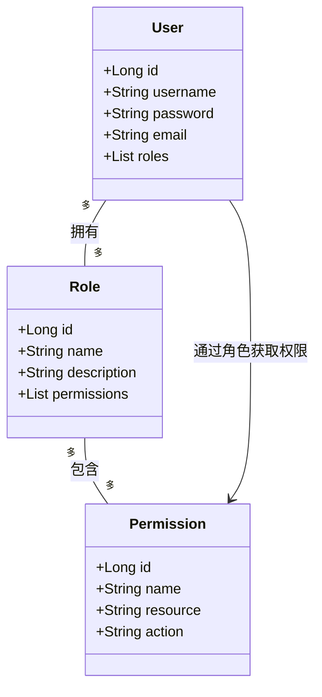
```mermaid
classDiagram
    class User {
        +Long id
        +String username
        +String password
        +String email
        +List<Role> roles
    }
    
    class Role {
        +Long id
        +String name
        +String description
        +List<Permission> permissions
    }
    
    class Permission {
        +Long id
        +String name
        +String resource
        +String action
    }
    
    User "多" -- "多" Role: 拥有
    Role "多" -- "多" Permission: 包含
    User --> Permission: 通过角色获取权限
```

注：此RBAC模型的核心逻辑将被提取到公共安全模块，以便所有微服务可以使用一致的权限检查机制。

### 2.4 核心功能模块

#### 2.4.1 用户认证（Authentication）
- 账号密码登录
- 手机号验证码登录（预留）
- 第三方账号登录（预留）
- 双因素认证支持（预留）
- 登录失败处理
  - 账号锁定机制
  - 验证码校验
  - 登录失败次数限制

#### 2.4.2 RBAC权限控制
- 三层权限模型
  - 用户（User）
  - 角色（Role）
  - 权限（Permission）
- 权限管理功能
  - 角色创建与管理
  - 权限分配与回收
  - 权限继承关系
- 动态权限控制
  - 基于注解的权限校验
  - 动态权限更新
  - 权限缓存机制

#### 2.4.3 OAuth2 授权服务
- 支持的授权模式
  - 授权码模式（Authorization Code）
  - 刷新令牌（Refresh Token）
- PKCE 安全增强
  - code_verifier 验证
  - code_challenge 生成
  - PKCE 流程实现
- 客户端管理
  - 客户端注册
  - 客户端认证
  - 授权范围控制

#### 2.4.4 令牌管理
- JWT令牌
  - 访问令牌（Access Token）
  - 刷新令牌（Refresh Token）
  - ID令牌（ID Token）- OIDC新增
- 令牌操作
  - 令牌签发
  - 令牌验证
  - 令牌撤销
  - 令牌内省
- 安全特性
  - 令牌加密
  - 令牌黑名单
  - 令牌自动续期

#### 2.4.5 OpenID Connect（新增）
- 核心功能
  - ID Token生成与验证
  - UserInfo端点
  - 发现文档（Discovery Document）
  - JWKS端点（JSON Web Key Set）
- 支持的Scope
  - openid（必须）
  - profile
  - email
- 标准声明支持
  - 用户标识（sub）
  - 用户名称（name）
  - 电子邮件（email）
  - 角色信息（roles）

### 2.5 技术架构

#### 2.5.1 核心框架
- Spring Boot 3.x：应用基础框架
- Spring Security 6.x：安全框架
- Spring Data JPA：数据访问层

#### 2.5.2 存储方案
- MySQL：
  - 用户数据
  - 角色权限
  - 客户端信息
  - 授权记录
- Redis：
  - 令牌黑名单
  - 权限缓存
  - 验证码存储
  - 登录失败计数

#### 2.5.3 公共安全模块（新增）
- JWT工具类
  - 令牌验证
  - 内容提取
  - 过期检查
- 用户主体类
  - 用户身份信息
  - 权限信息封装
  - 角色检查方法
- 权限检查器
  - 资源访问控制
  - 权限表达式解析
  - 角色继承支持
- 安全注解
  - `@RequirePermission`
  - `@RequireRole`
  - `@PublicAccess`

## 3. OAuth 2.0 与 OIDC 实现细节

### 3.1 支持的授权流程

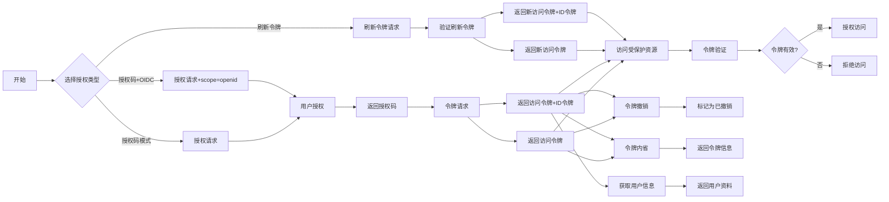
```mermaid
graph LR
    A[开始] --> B{选择授权类型}
    B -->|授权码模式| C[授权请求]
    B -->|授权码+OIDC| C1[授权请求+scope=openid]
    C --> D[用户授权]
    C1 --> D
    D --> E[返回授权码]
    E --> F[令牌请求]
    F --> G[返回访问令牌]
    F --> G1[返回访问令牌+ID令牌]
    
    B -->|刷新令牌| H[刷新令牌请求]
    H --> I[验证刷新令牌]
    I --> J[返回新访问令牌]
    I --> J1[返回新访问令牌+ID令牌]
    
    G --> K[访问受保护资源]
    G1 --> K
    J --> K
    J1 --> K
    K --> L[令牌验证]
    L --> M{令牌有效?}
    M -->|是| N[授权访问]
    M -->|否| O[拒绝访问]
    
    G --> P[令牌撤销]
    G1 --> P
    P --> Q[标记为已撤销]
    
    G --> R[令牌内省]
    G1 --> R
    R --> S[返回令牌信息]
    
    G1 --> T[获取用户信息]
    T --> U[返回用户资料]
```

### 3.2 令牌生命周期

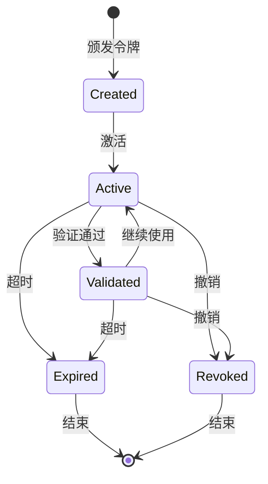
```mermaid
stateDiagram-v2
    [*] --> Created: 颁发令牌
    Created --> Active: 激活
    Active --> Validated: 验证通过
    Active --> Expired: 超时
    Active --> Revoked: 撤销
    Validated --> Active: 继续使用
    Validated --> Expired: 超时
    Validated --> Revoked: 撤销
    Expired --> [*]: 结束
    Revoked --> [*]: 结束
```

### 3.3 OIDC与公共模块交互

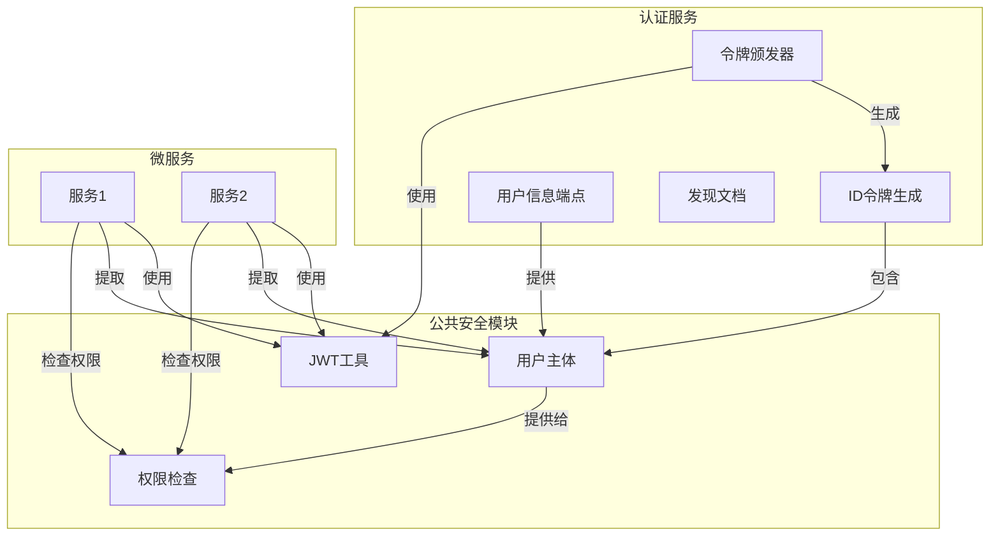
```mermaid
graph TD
    subgraph AuthService[认证服务]
        Issuer[令牌颁发器]
        IDToken[ID令牌生成]
        UserInfo[用户信息端点]
        Discovery[发现文档]
    end
    
    subgraph CommonModule[公共安全模块]
        JwtUtil[JWT工具]
        Principal[用户主体]
        PermCheck[权限检查]
    end
    
    subgraph Services[微服务]
        Service1[服务1]
        Service2[服务2]
    end
    
    Issuer -->|生成| IDToken
    Issuer -->|使用| JwtUtil
    IDToken -->|包含| Principal
    UserInfo -->|提供| Principal
    Service1 -->|使用| JwtUtil
    Service1 -->|提取| Principal
    Service1 -->|检查权限| PermCheck
    Service2 -->|使用| JwtUtil
    Service2 -->|提取| Principal
    Service2 -->|检查权限| PermCheck
    Principal -->|提供给| PermCheck
```

## 4. API 端点

### 4.1 认证相关端点

#### 用户注册
```http
POST /api/auth/register
Content-Type: application/json

{
    "username": "string",
    "password": "string",
    "email": "string"
}
```

响应:
```json
{
    "accessToken": "string",
    "tokenType": "Bearer",
    "expiresIn": 3600,
    "refreshToken": "string",
    "scope": "string"
}
```

#### 用户登录
```http
POST /api/auth/login
Content-Type: application/json

{
    "username": "string",
    "password": "string"
}
```

响应: 同注册接口

### 4.2 OAuth2 端点安全性说明

所有涉及客户端凭据的端点都需要使用客户端认证，必须使用 HTTP Basic 认证方式。

#### 4.2.1 授权请求
```http
GET /api/oauth2/authorize
    ?response_type=code
    &client_id={clientId}
    &redirect_uri={redirectUri}
    &scope={scope}
    &state={state}
    &code_challenge={codeChallenge}
    &code_challenge_method=S256
```

注：对于OIDC请求，scope参数必须包含"openid"

#### 4.2.2 令牌请求
```http
POST /api/oauth2/token
Authorization: Basic {base64(client_id:client_secret)}
Content-Type: application/x-www-form-urlencoded

grant_type=authorization_code&
code=string&
redirect_uri=string&
code_verifier=string
```

响应:
```json
{
    "access_token": "eyJhbGciOiJIUzUxMiJ9...",
    "token_type": "Bearer",
    "expires_in": 3600,
    "refresh_token": "eyJhbGciOiJIUzUxMiJ9...",
    "scope": "read write",
    "id_token": "eyJhbGciOiJIUzUxMiJ9..."  // 仅当scope包含openid时返回
}
```

#### 4.2.3 令牌撤销
```http
POST /api/oauth2/revoke
Authorization: Basic {base64(client_id:client_secret)}
Content-Type: application/x-www-form-urlencoded

token=string&
token_type_hint=access_token
```

安全要求：**必须使用客户端认证**

#### 4.2.4 令牌内省
```http
POST /api/oauth2/introspect
Authorization: Basic {base64(client_id:client_secret)}
Content-Type: application/x-www-form-urlencoded

token=string&
token_type_hint=access_token
```

安全要求：**必须使用客户端认证**

响应:
```json
{
    "active": true,
    "client_id": "client-id",
    "username": "user",
    "scope": "read write",
    "exp": 1613829600,
    "iat": 1613826000,
    "token_type": "Bearer"
}
```

### 4.3 OIDC 端点 (新增)

#### 4.3.1 用户信息端点
```http
GET /api/oauth2/userinfo
Authorization: Bearer {access_token}
```

响应:
```json
{
    "sub": "123456789",
    "name": "张三",
    "preferred_username": "zhangsan",
    "email": "zhangsan@example.com",
    "email_verified": true,
    "roles": ["USER", "ADMIN"]
}
```

#### 4.3.2 发现文档端点
```http
GET /api/oauth2/.well-known/openid-configuration
```

响应:
```json
{
    "issuer": "https://auth.example.com",
    "authorization_endpoint": "https://auth.example.com/api/oauth2/authorize",
    "token_endpoint": "https://auth.example.com/api/oauth2/token",
    "userinfo_endpoint": "https://auth.example.com/api/oauth2/userinfo",
    "jwks_uri": "https://auth.example.com/api/oauth2/jwks",
    "response_types_supported": ["code"],
    "subject_types_supported": ["public"],
    "id_token_signing_alg_values_supported": ["RS256"],
    "scopes_supported": ["openid", "profile", "email"],
    "token_endpoint_auth_methods_supported": ["client_secret_basic"],
    "claims_supported": [
        "sub", "iss", "auth_time", "name", 
        "preferred_username", "email", "email_verified", "roles"
    ]
}
```

#### 4.3.3 JSON Web Key Set 端点
```http
GET /api/oauth2/jwks
```

响应:
```json
{
    "keys": [
        {
            "kty": "RSA",
            "use": "sig",
            "kid": "key-id-1",
            "alg": "RS256",
            "n": "base64-encoded-modulus",
            "e": "base64-encoded-exponent"
        }
    ]
}
```

### 4.4 用户管理端点

#### 创建用户（管理员）
```http
POST /api/users
Content-Type: application/json

{
    "username": "string",
    "password": "string",
    "email": "string",
    "roleIds": [1, 2]
}
```

#### 更新用户
```http
PUT /api/users/{userId}
Content-Type: application/json

{
    "email": "string",
    "roleIds": [1, 2]
}
```

## 5. 数据模型

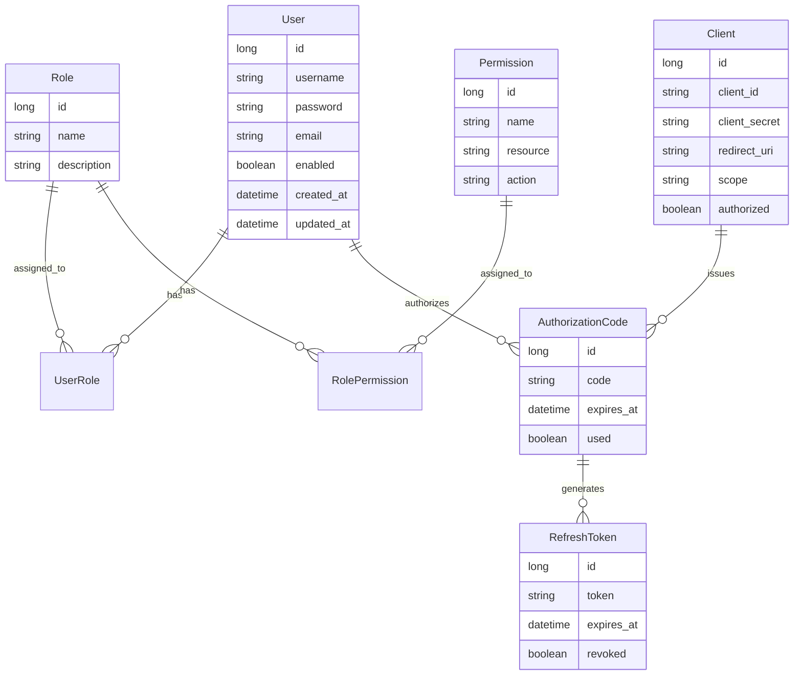
```mermaid
erDiagram
    User ||--o{ UserRole : has
    Role ||--o{ UserRole : assigned_to
    Role ||--o{ RolePermission : has
    Permission ||--o{ RolePermission : assigned_to
    Client ||--o{ AuthorizationCode : issues
    User ||--o{ AuthorizationCode : authorizes
    AuthorizationCode ||--o{ RefreshToken : generates
    
    User {
        long id
        string username
        string password
        string email
        boolean enabled
        datetime created_at
        datetime updated_at
    }
    
    Role {
        long id
        string name
        string description
    }
    
    Permission {
        long id
        string name
        string resource
        string action
    }
    
    Client {
        long id
        string client_id
        string client_secret
        string redirect_uri
        string scope
        boolean authorized
    }
    
    AuthorizationCode {
        long id
        string code
        datetime expires_at
        boolean used
    }
    
    RefreshToken {
        long id
        string token
        datetime expires_at
        boolean revoked
    }
```

## 6. 错误码说明

### 6.1 认证错误 (3003xx)
- 300301: TOKEN_EXPIRED - 令牌已过期
- 300302: TOKEN_INVALID - 无效的令牌
- 300303: TOKEN_REVOKED - 令牌已被撤销
- 300304: TOKEN_NOT_FOUND - 令牌不存在

### 6.2 授权错误 (3004xx)
- 300401: CLIENT_UNAUTHORIZED - 未授权的客户端
- 300402: INVALID_AUTHORIZATION_CODE - 无效的授权码
- 300403: INVALID_GRANT - 无效的授权类型
- 300404: INVALID_SCOPE - 无效的权限范围

### 6.3 参数错误 (3005xx)
- 300501: PARAMETER_VALIDATION_FAILED - 参数验证失败
- 300502: MISSING_REQUIRED_PARAMETER - 缺少必需参数

### 6.4 客户端错误 (3010xx)
- 301001: CLIENT_NOT_FOUND - 客户端不存在
- 301002: CLIENT_AUTHENTICATION_FAILED - 客户端认证失败
- 301003: INVALID_REDIRECT_URI - 无效的重定向URI

### 6.5 OIDC错误 (3011xx) - 新增
- 301101: INVALID_ID_TOKEN - 无效的ID令牌
- 301102: USERINFO_ACCESS_DENIED - 用户信息访问被拒绝
- 301103: MISSING_OPENID_SCOPE - 缺少openid范围

## 7. 安全机制

### 7.1 密码安全
- BCrypt 加密存储
- 密码强度要求：
  - 最小长度：8位
  - 必须包含：大小写字母、数字、特殊字符
  - 不允许连续重复字符

### 7.2 令牌安全
- JWT格式
- RS256签名算法 (非对称加密)
- 访问令牌有效期：1小时
- 刷新令牌有效期：30天
- ID令牌有效期：1小时
- 支持令牌撤销
- 令牌黑名单机制

### 7.3 客户端认证流程

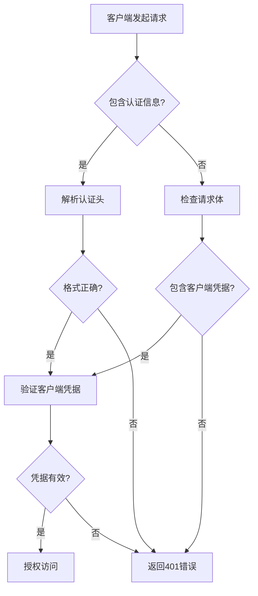
```mermaid
flowchart TD
    A[客户端发起请求] --> B{包含认证信息?}
    B -->|是| C[解析认证头]
    B -->|否| D[检查请求体]
    C --> E{格式正确?}
    E -->|是| F[验证客户端凭据]
    E -->|否| G[返回401错误]
    D --> H{包含客户端凭据?}
    H -->|是| F
    H -->|否| G
    F --> I{凭据有效?}
    I -->|是| J[授权访问]
    I -->|否| G
```

### 7.4 登录安全
- 失败次数限制：5次/30分钟
- 账号锁定时间：30分钟
- IP限流：100次/分钟
- 支持登录日志记录

## 8. 缓存策略

### 8.1 Redis缓存
- 令牌黑名单
- 用户权限缓存
- 登录失败计数
- 权限树缓存

### 8.2 缓存时间
- 令牌黑名单：与令牌有效期一致
- 用户权限：30分钟
- 登录失败计数：30分钟
- 权限树：24小时

### 8.3 缓存策略优化

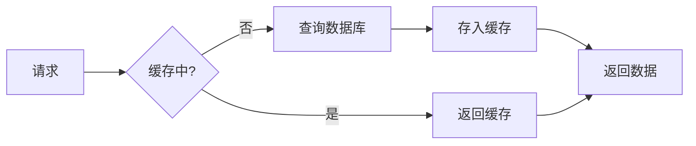
```mermaid
graph LR
    A[请求] --> B{缓存中?}
    B -->|是| C[返回缓存]
    B -->|否| D[查询数据库]
    D --> E[存入缓存]
    E --> F[返回数据]
    C --> F
```

## 9. 集成测试

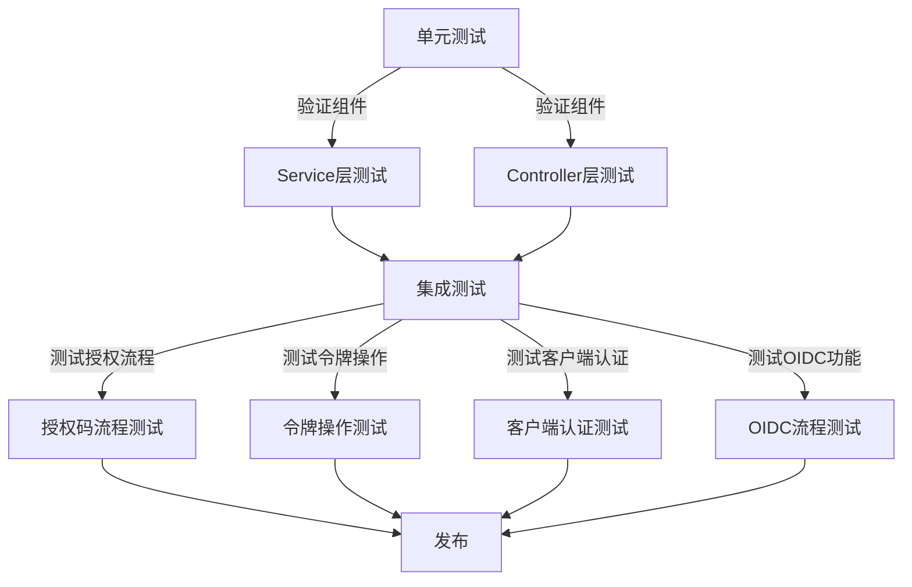
```mermaid
graph TD
    A[单元测试] -->|验证组件| B[Service层测试]
    A -->|验证组件| C[Controller层测试]
    B --> D[集成测试]
    C --> D
    D -->|测试授权流程| E[授权码流程测试]
    D -->|测试令牌操作| F[令牌操作测试]
    D -->|测试客户端认证| G[客户端认证测试]
    D -->|测试OIDC功能| H[OIDC流程测试]
    E --> I[发布]
    F --> I
    G --> I
    H --> I
```

## 10. 部署架构

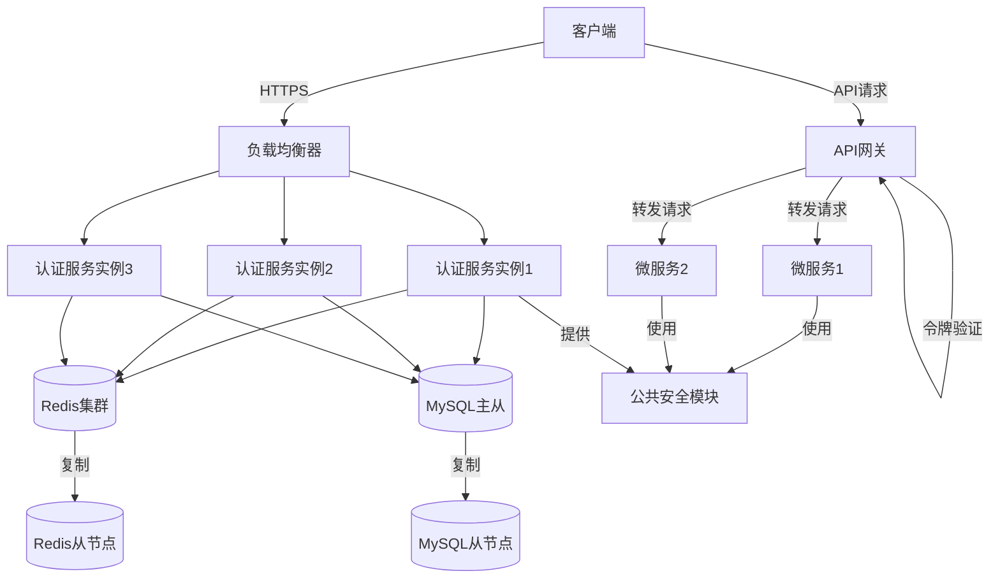
```mermaid
graph TD
    Client[客户端] -->|HTTPS| LB[负载均衡器]
    LB --> Auth1[认证服务实例1]
    LB --> Auth2[认证服务实例2]
    LB --> Auth3[认证服务实例3]
    Auth1 --> Redis[(Redis集群)]
    Auth2 --> Redis
    Auth3 --> Redis
    Auth1 --> DB[(MySQL主从)]
    Auth2 --> DB
    Auth3 --> DB
    Redis -->|复制| RedisSlave[(Redis从节点)]
    DB -->|复制| DBSlave[(MySQL从节点)]
    
    Client -->|API请求| Gateway[API网关]
    Gateway -->|令牌验证| Gateway
    Gateway -->|转发请求| Service1[微服务1]
    Gateway -->|转发请求| Service2[微服务2]
    Service1 -->|使用| Common[公共安全模块]
    Service2 -->|使用| Common
    Auth1 -->|提供| Common
```

### 10.1 环境要求
- JDK 17+
- MySQL 8.0+
- Redis 6.0+
- 最小内存：4GB
- 推荐CPU：4核

### 10.2 配置项
```yaml
auth:
  jwt:
    private-key: classpath:keys/private.pem
    public-key: classpath:keys/public.pem
    access-token-validity: 3600
    refresh-token-validity: 2592000
    id-token-validity: 3600
  security:
    password-strength: true
    max-login-attempts: 5
    lock-duration: 1800
  redis:
    token-blacklist-prefix: "token:blacklist:"
    user-permission-prefix: "user:permission:"
  oidc:
    issuer: "https://your-auth-server.com"
    enabled: true
```

## 11. 监控与告警

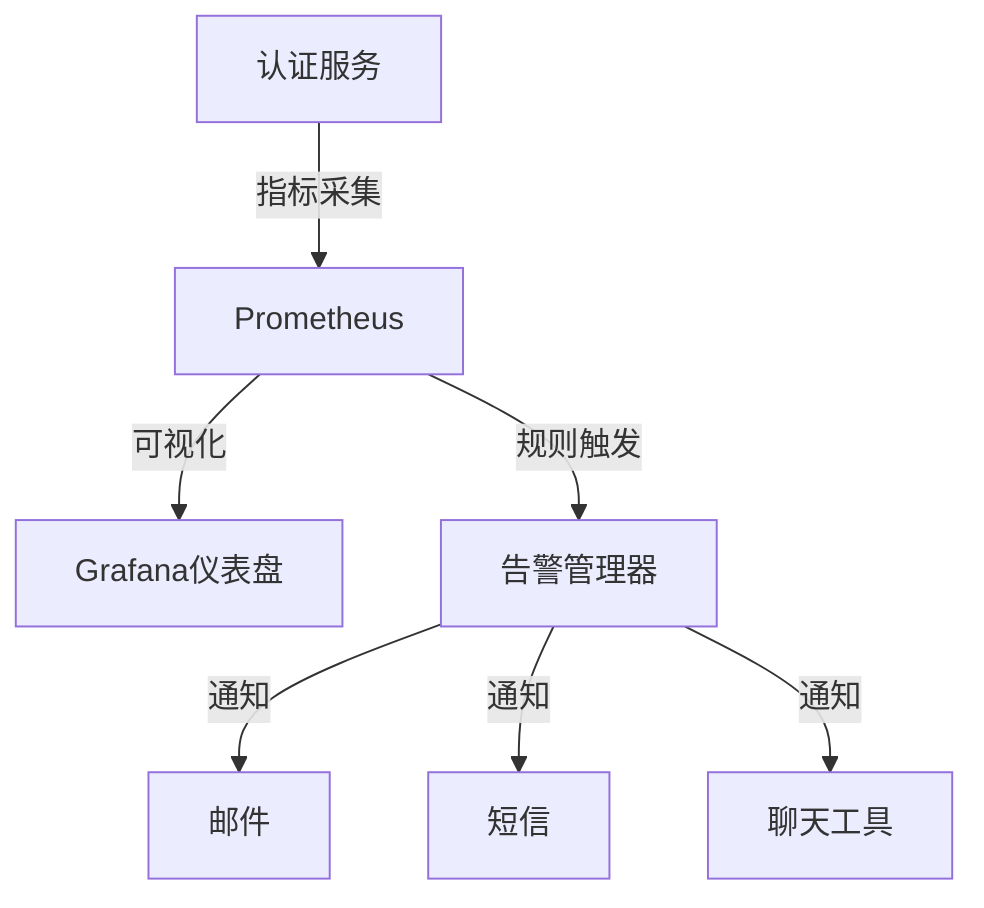
```mermaid
graph TD
    Auth[认证服务] -->|指标采集| Prom[Prometheus]
    Prom -->|可视化| Grafana[Grafana仪表盘]
    Prom -->|规则触发| Alert[告警管理器]
    Alert -->|通知| Email[邮件]
    Alert -->|通知| SMS[短信]
    Alert -->|通知| Chat[聊天工具]
```

### 11.1 性能指标
- API响应时间
- 并发请求数
- 缓存命中率
- 数据库连接数

### 11.2 安全指标
- 登录失败率
- 令牌撤销次数
- 无效令牌访问次数
- 异常IP访问次数

## 12. 常见问题与解决方案

### 12.1 令牌相关
Q: 如何处理令牌过期？
A: 使用刷新令牌获取新的访问令牌，如果刷新令牌也过期，需要重新登录。

Q: 令牌撤销后如何处理？
A: 令牌撤销后会被加入黑名单，需要重新获取令牌。客户端应当捕获401响应并处理重新认证流程。

Q: 客户端认证应该使用哪种方式？
A: 根据OAuth 2.0规范，必须使用HTTP Basic认证方式。将客户端ID和密钥以`client_id:client_secret`格式进行Base64编码，放在Authorization头中发送。

### 12.2 权限相关
Q: 如何动态更新权限？
A: 权限更新后会自动清除相关缓存，下次请求时会重新加载。

Q: 角色和权限的关系？
A: 采用RBAC模型，用户分配角色，角色包含权限。支持角色继承和权限组。

### 12.3 性能相关
Q: 如何处理大量令牌撤销的性能问题？
A: 使用Redis存储令牌黑名单，设置过期时间与令牌有效期一致，避免黑名单无限增长。

Q: 如何确保系统安全性？
A: 确保所有敏感操作都需要认证，使用HTTPS传输，实施密码加密存储，对令牌进行签名，并实现令牌撤销机制。

### 12.4 OIDC相关 (新增)
Q: ID令牌与访问令牌的区别？
A: ID令牌包含用户身份信息，用于认证；访问令牌包含权限信息，用于授权。

Q: 微服务如何验证用户身份？
A: 微服务使用公共安全模块从JWT令牌中提取用户信息，无需再次访问认证服务器。

Q: 如何处理不同服务对用户信息的不同需求？
A: 通过不同的scope组合来请求不同的用户信息，例如profile、email等。

## 13. 客户端集成示例

### 13.1 OAuth2 客户端接入
```java
@Configuration
public class OAuth2ClientConfig {
    @Bean
    public OAuth2AuthorizedClientManager authorizedClientManager(
            ClientRegistrationRepository clientRegistrationRepository,
            OAuth2AuthorizedClientRepository authorizedClientRepository) {
        
        OAuth2AuthorizedClientProvider authorizedClientProvider = 
            OAuth2AuthorizedClientProviderBuilder.builder()
                .authorizationCode()
                .refreshToken()
                .build();
                
        DefaultOAuth2AuthorizedClientManager authorizedClientManager = 
            new DefaultOAuth2AuthorizedClientManager(
                clientRegistrationRepository, 
                authorizedClientRepository);
                
        authorizedClientManager.setAuthorizedClientProvider(authorizedClientProvider);
        
        return authorizedClientManager;
    }
}
```

### 13.2 OIDC 客户端接入 (新增)
```java
@Configuration
public class OidcClientConfig {
    @Bean
    public ClientRegistration oidcClientRegistration() {
        return ClientRegistration.withRegistrationId("auth-server")
            .clientId("client-id")
            .clientSecret("client-secret")
            .clientAuthenticationMethod(ClientAuthenticationMethod.CLIENT_SECRET_BASIC)
            .authorizationGrantType(AuthorizationGrantType.AUTHORIZATION_CODE)
            .redirectUri("{baseUrl}/login/oauth2/code/{registrationId}")
            .scope("openid", "profile", "email")
            .authorizationUri("https://auth.example.com/api/oauth2/authorize")
            .tokenUri("https://auth.example.com/api/oauth2/token")
            .userInfoUri("https://auth.example.com/api/oauth2/userinfo")
            .jwkSetUri("https://auth.example.com/api/oauth2/jwks")
            .clientName("Auth Server")
            .build();
    }
}
```

### 13.3 资源服务器配置
```java
@Configuration
@EnableWebSecurity
public class ResourceServerConfig {
    @Bean
    public SecurityFilterChain securityFilterChain(HttpSecurity http) throws Exception {
        http
            .oauth2ResourceServer(oauth2 -> oauth2
                .jwt(jwt -> jwt
                    .jwtAuthenticationConverter(jwtAuthenticationConverter())
                )
            )
            .authorizeHttpRequests(authorize -> authorize
                .requestMatchers("/api/public/**").permitAll()
                .requestMatchers("/api/admin/**").hasRole("ADMIN")
                .anyRequest().authenticated()
            );
            
        return http.build();
    }
    
    private JwtAuthenticationConverter jwtAuthenticationConverter() {
        JwtGrantedAuthoritiesConverter jwtGrantedAuthoritiesConverter = new JwtGrantedAuthoritiesConverter();
        jwtGrantedAuthoritiesConverter.setAuthoritiesClaimName("authorities");
        jwtGrantedAuthoritiesConverter.setAuthorityPrefix("ROLE_");
        
        JwtAuthenticationConverter jwtAuthenticationConverter = new JwtAuthenticationConverter();
        jwtAuthenticationConverter.setJwtGrantedAuthoritiesConverter(jwtGrantedAuthoritiesConverter);
        return jwtAuthenticationConverter;
    }
}
```

### 13.4 使用公共安全模块 (新增)
```java
@Service
public class ExampleService {
    
    @Autowired
    private JwtUtils jwtUtils;
    
    public void processSecureRequest(String token, String resource) {
        // 1. 验证令牌
        if (!jwtUtils.validateToken(token)) {
            throw new AccessDeniedException("Invalid token");
        }
        
        // 2. 提取用户信息
        UserPrincipal user = UserPrincipal.fromJwt(token);
        
        // 3. 检查权限
        if (!user.hasPermission(resource, "read")) {
            throw new AccessDeniedException("Permission denied");
        }
        
        // 4. 处理业务逻辑...
    }
}
```

## 14. 开发计划 (新增)

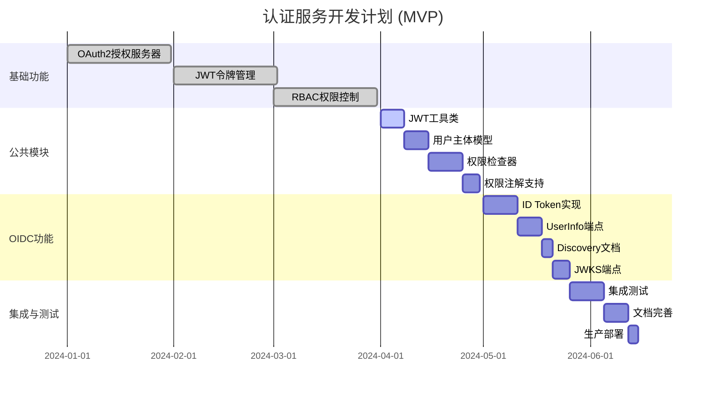
```mermaid
gantt
    title 认证服务开发计划 (MVP)
    dateFormat  YYYY-MM-DD
    section 基础功能
    OAuth2授权服务器         :done, 2024-01-01, 30d
    JWT令牌管理              :done, 2024-02-01, 30d
    RBAC权限控制             :done, 2024-03-01, 30d
    section 公共模块
    JWT工具类             :active, 2024-04-01, 7d
    用户主体模型          :2024-04-08, 7d
    权限检查器            :2024-04-15, 10d
    权限注解支持          :2024-04-25, 5d
    section OIDC功能
    ID Token实现          :2024-05-01, 10d
    UserInfo端点          :2024-05-11, 7d
    Discovery文档         :2024-05-18, 3d
    JWKS端点              :2024-05-21, 5d
    section 集成与测试
    集成测试             :2024-05-26, 10d
    文档完善             :2024-06-05, 7d
    生产部署             :2024-06-12, 3d
```

### 14.1 JWT与RBAC公共模块开发

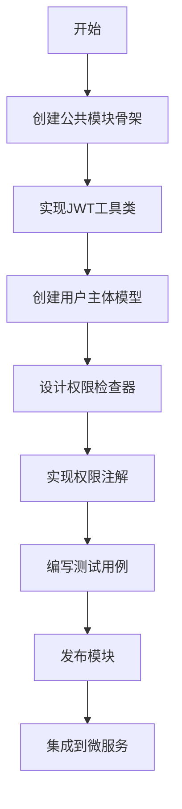
```mermaid
graph TD
    A[开始] --> B[创建公共模块骨架]
    B --> C[实现JWT工具类]
    C --> D[创建用户主体模型]
    D --> E[设计权限检查器]
    E --> F[实现权限注解]
    F --> G[编写测试用例]
    G --> H[发布模块]
    H --> I[集成到微服务]
```

1. **阶段1：JWT工具类**
   - 令牌验证方法
   - 令牌解析方法
   - 过期检查方法
   - 签名验证方法

2. **阶段2：用户主体模型**
   - 用户基本信息字段
   - 角色集合
   - 权限集合
   - 从JWT创建用户主体的方法

3. **阶段3：权限检查器**
   - 权限表达式解析
   - 用户角色检查
   - 用户权限检查
   - 权限继承支持

4. **阶段4：权限注解**
   - RequirePermission注解
   - RequireRole注解
   - PublicAccess注解
   - 注解处理器

### 14.2 OIDC实现计划

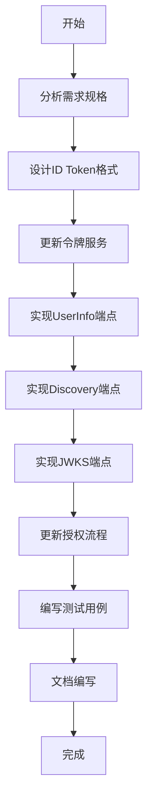
```mermaid
graph TD
    A[开始] --> B[分析需求规格]
    B --> C[设计ID Token格式]
    C --> D[更新令牌服务]
    D --> E[实现UserInfo端点]
    E --> F[实现Discovery端点]
    F --> G[实现JWKS端点]
    G --> H[更新授权流程]
    H --> I[编写测试用例]
    I --> J[文档编写]
    J --> K[完成]
```

1. **阶段1：ID Token实现**
   - 定义ID Token声明集
   - 实现ID Token生成逻辑
   - 集成到令牌端点

2. **阶段2：UserInfo端点**
   - 实现用户信息获取接口
   - 添加安全控制
   - 支持范围筛选

3. **阶段3：Discovery文档**
   - 实现OpenID配置端点
   - 配置支持的功能
   - 暴露可用端点

4. **阶段4：JWKS端点**
   - 生成密钥对
   - 实现公钥暴露接口
   - 密钥轮换支持

## 15. 设计原则与实践

### 15.1 架构设计原则

认证服务的设计遵循以下核心原则：

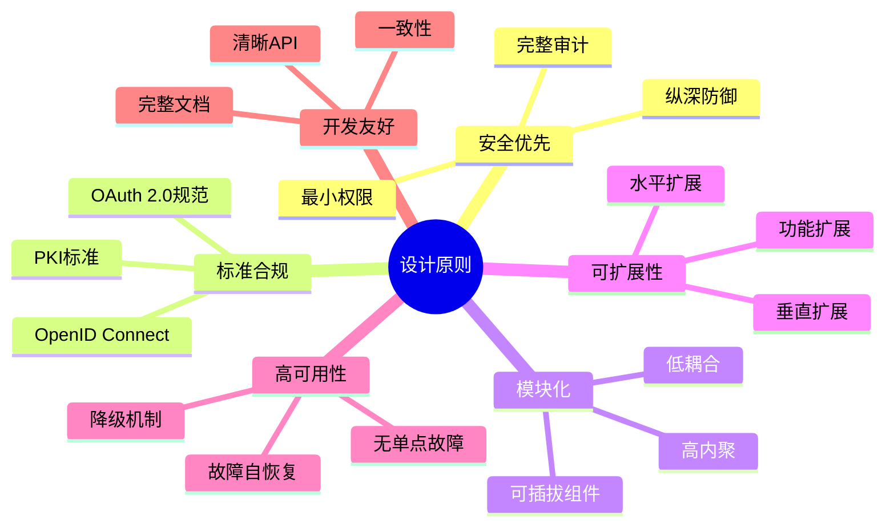
```mermaid
mindmap
  root((设计原则))
    安全优先
      纵深防御
      最小权限
      完整审计
    标准合规
      OAuth 2.0规范
      OpenID Connect
      PKI标准
    模块化
      高内聚
      低耦合
      可插拔组件
    可扩展性
      水平扩展
      垂直扩展
      功能扩展
    高可用性
      无单点故障
      故障自恢复
      降级机制
    开发友好
      清晰API
      完整文档
      一致性
```

#### 15.1.1 安全优先

- **纵深防御**：通过多层安全控制确保系统安全，包括网络层、应用层、数据层的安全措施。
- **最小权限原则**：所有组件和用户仅获取完成任务所需的最小权限集合。
- **敏感数据保护**：所有敏感数据如密码、密钥等均经过加密存储，传输过程中使用TLS加密。
- **安全默认配置**：系统默认配置是安全的，需要显式启用非安全选项。

#### 15.1.2 标准合规

- **OAuth 2.0标准**：严格遵循RFC 6749、RFC 6750等OAuth 2.0规范。
- **OpenID Connect标准**：遵循OIDC核心规范，支持ID令牌和用户信息端点。
- **JWT标准**：令牌生成和验证遵循RFC 7519标准。
- **PKCE扩展**：实现RFC 7636的PKCE扩展，增强授权码流程安全性。
- **令牌撤销**：实现RFC 7009的令牌撤销标准。
- **令牌内省**：实现RFC 7662的令牌内省标准。

#### 15.1.3 模块化设计

认证服务采用模块化设计，确保各组件高内聚、低耦合，便于维护和扩展：

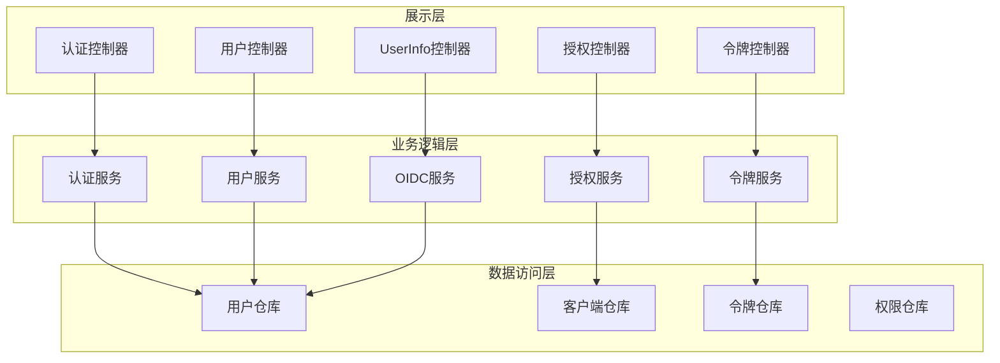
```mermaid
graph TD
    subgraph "展示层"
        C1[认证控制器]
        C2[授权控制器]
        C3[令牌控制器]
        C4[用户控制器]
        C5[UserInfo控制器]
    end
    
    subgraph "业务逻辑层"
        S1[认证服务]
        S2[授权服务]
        S3[令牌服务]
        S4[用户服务]
        S5[OIDC服务]
    end
    
    subgraph "数据访问层"
        R1[用户仓库]
        R2[客户端仓库]
        R3[令牌仓库]
        R4[权限仓库]
    end
    
    C1 --> S1
    C2 --> S2
    C3 --> S3
    C4 --> S4
    C5 --> S5
    
    S1 --> R1
    S2 --> R2
    S3 --> R3
    S4 --> R1
    S5 --> R1
```

### 15.2 公共安全模块设计 (新增)

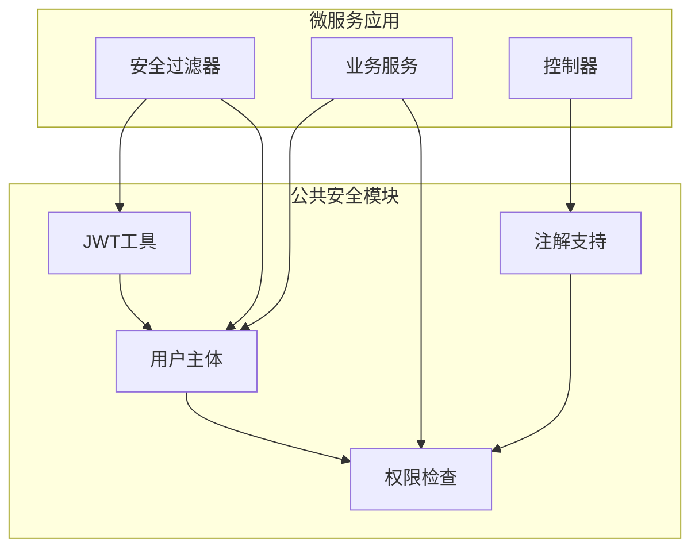
```mermaid
graph TD
    subgraph "公共安全模块"
        JWT[JWT工具]
        Principal[用户主体]
        PermCheck[权限检查]
        Annotations[注解支持]
    end
    
    subgraph "微服务应用"
        Filter[安全过滤器]
        Service[业务服务]
        Controller[控制器]
    end
    
    JWT --> Principal
    Principal --> PermCheck
    Annotations --> PermCheck
    
    Filter --> JWT
    Filter --> Principal
    Service --> Principal
    Service --> PermCheck
    Controller --> Annotations
```

#### 15.2.1 JWT工具设计

JWT工具类提供以下核心功能：
- 令牌验证：验证令牌签名和有效期
- 内容提取：安全地提取令牌中的Claims
- 权限解析：从令牌中提取权限信息

```java
public class JwtUtils {
    /**
     * 验证JWT令牌
     * @param token JWT令牌
     * @param publicKeyString RSA公钥
     * @return 验证结果
     */
    public static boolean validateToken(String token, String publicKeyString) {
        try {
            Jwts.parserBuilder()
                .setSigningKey(parsePublicKey(publicKeyString))
                .build()
                .parseClaimsJws(token);
            return true;
        } catch (Exception e) {
            return false;
        }
    }
    
    /**
     * 从JWT令牌中提取Claims
     * @param token JWT令牌
     * @param publicKeyString RSA公钥
     * @return Claims对象
     */
    public static Claims extractClaims(String token, String publicKeyString) {
        return Jwts.parserBuilder()
            .setSigningKey(parsePublicKey(publicKeyString))
            .build()
            .parseClaimsJws(token)
            .getBody();
    }
}
```

#### 15.2.2 用户主体设计

用户主体类封装了用户身份和权限信息：
- 用户标识信息（ID、用户名等）
- 用户角色集合
- 用户权限集合
- 权限检查方法

```java
public class UserPrincipal implements Serializable {
    private String id;
    private String username;
    private String name;
    private List<String> roles = new ArrayList<>();
    private List<String> permissions = new ArrayList<>();
    
    /**
     * 从JWT令牌创建用户主体
     * @param token JWT令牌
     * @param publicKey 公钥
     * @return 用户主体对象
     */
    public static UserPrincipal fromJwt(String token, String publicKey) {
        Claims claims = JwtUtils.extractClaims(token, publicKey);
        
        UserPrincipal principal = new UserPrincipal();
        principal.setId(claims.getSubject());
        principal.setUsername(claims.get("preferred_username", String.class));
        principal.setName(claims.get("name", String.class));
        
        List<String> roles = claims.get("roles", List.class);
        if (roles != null) {
            principal.setRoles(roles);
        }
        
        List<String> permissions = claims.get("permissions", List.class);
        if (permissions != null) {
            principal.setPermissions(permissions);
        }
        
        return principal;
    }
    
    /**
     * 检查是否拥有指定角色
     */
    public boolean hasRole(String role) {
        return roles.contains(role);
    }
    
    /**
     * 检查是否拥有指定权限
     */
    public boolean hasPermission(String resource, String action) {
        return permissions.contains(resource + ":" + action);
    }
}
```

#### 15.2.3 权限注解设计

提供简洁的注解接口用于权限控制：

```java
@Target({ElementType.METHOD, ElementType.TYPE})
@Retention(RetentionPolicy.RUNTIME)
public @interface RequirePermission {
    /**
     * 资源标识
     */
    String resource();
    
    /**
     * 操作标识
     */
    String action();
}

@Target({ElementType.METHOD, ElementType.TYPE})
@Retention(RetentionPolicy.RUNTIME)
public @interface RequireRole {
    /**
     * 角色名称
     */
    String[] value();
    
    /**
     * 逻辑关系：AND - 需要所有角色, OR - 需要任一角色
     */
    String logic() default "OR";
}
```

### 15.3 OIDC实现设计 (新增)

#### 15.3.1 ID Token设计

ID Token包含用户身份信息，采用JWT格式：

```json
{
  "iss": "https://auth.example.com",
  "sub": "1234567890",
  "aud": "client-id",
  "exp": 1516239022,
  "iat": 1516235422,
  "auth_time": 1516235422,
  "name": "张三",
  "preferred_username": "zhangsan",
  "email": "zhangsan@example.com",
  "email_verified": true,
  "roles": ["USER", "ADMIN"]
}
```

实现方式：

```java
private String generateIdToken(User user, String clientId, Set<String> scopes) {
    Date now = new Date();
    Date expiry = new Date(now.getTime() + idTokenValidity);
    
    // 构建基本声明
    JwtBuilder builder = Jwts.builder()
        .setIssuer(issuerUrl)
        .setSubject(user.getId().toString())
        .setAudience(clientId)
        .setIssuedAt(now)
        .setExpiration(expiry)
        .claim("auth_time", now.getTime() / 1000);
    
    // 根据请求的scope添加声明
    if (scopes.contains("profile")) {
        builder.claim("name", user.getFullName());
        builder.claim("preferred_username", user.getUsername());
    }
    
    if (scopes.contains("email")) {
        builder.claim("email", user.getEmail());
        builder.claim("email_verified", user.isEmailVerified());
    }
    
    // 添加角色信息
    List<String> roles = user.getRoles().stream()
        .map(Role::getName)
        .collect(Collectors.toList());
    builder.claim("roles", roles);
    
    // 使用私钥签名
    return builder.signWith(privateKey, SignatureAlgorithm.RS256).compact();
}
```

### 15.4 微服务安全架构 (新增)

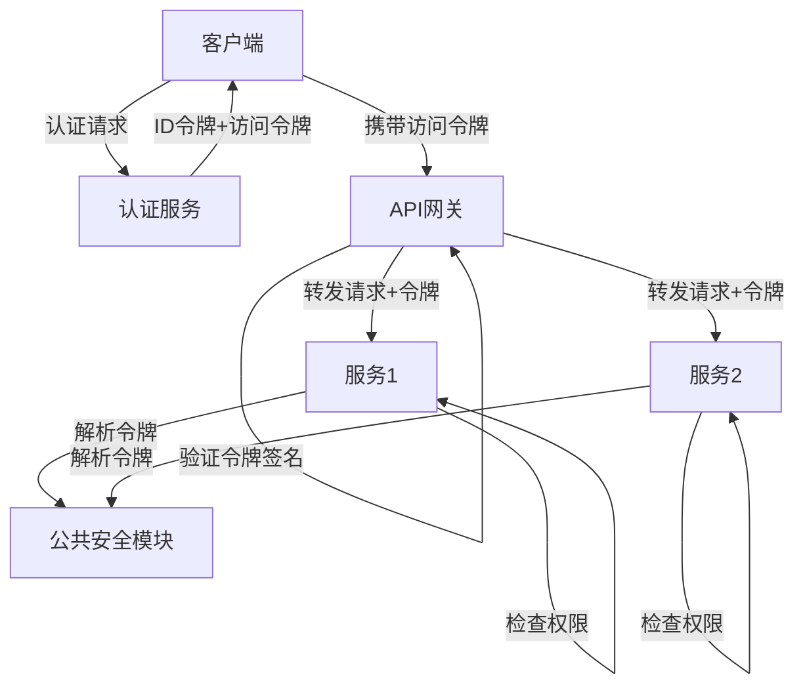
```mermaid
graph TD
    Client[客户端] -->|认证请求| Auth[认证服务]
    Auth -->|ID令牌+访问令牌| Client
    Client -->|携带访问令牌| Gateway[API网关]
    Gateway -->|验证令牌签名| Gateway
    Gateway -->|转发请求+令牌| Service1[服务1]
    Gateway -->|转发请求+令牌| Service2[服务2]
    Service1 -->|解析令牌| Common[公共安全模块]
    Service2 -->|解析令牌| Common
    Service1 -->|获取用户信息| Service1
    Service2 -->|获取用户信息| Service2
    Service1 -->|检查权限| Service1
    Service2 -->|检查权限| Service2
```

#### 15.4.1 认证流程

1. 客户端请求认证服务获取令牌
2. 认证服务验证用户凭据，颁发令牌
3. 客户端携带令牌访问API网关
4. API网关验证令牌签名和有效期
5. 请求转发到具体微服务
6. 微服务使用公共安全模块解析令牌
7. 提取用户信息和权限进行授权检查
8. 处理业务逻辑并返回结果

#### 15.4.2 安全边界划分

- **认证服务**：负责用户认证和令牌颁发
- **API网关**：负责令牌基础验证和请求路由
- **微服务**：负责细粒度授权和业务逻辑
- **公共安全模块**：提供一致的安全工具和模型

## 16. 后续演进计划

```mermaid
mindmap
  root((演进计划))
    认证增强
      多因素认证
      生物识别集成
      风险分析引擎
    协议扩展
      SAML 2.0
      WebAuthn
    安全强化
      硬件安全模块
      高级威胁检测
      零信任架构
    监控增强
      AI异常检测
      预测性分析
      实时告警
    性能优化
      全球分布式部署
      边缘计算支持
      极致响应时间
```

### 16.1 演进路线

1. **近期计划（3-6个月）**
   - 完善OIDC标准实现
   - 增强审计日志系统
   - 实现异常行为检测

2. **中期计划（6-12个月）**
   - 构建高级分析仪表板
   - 实现跨服务单点登录
   - 增强公共安全模块功能

3. **长期规划（1年以上）**
   - 分布式身份体系
   - 零信任安全架构
   - 自适应认证引擎
