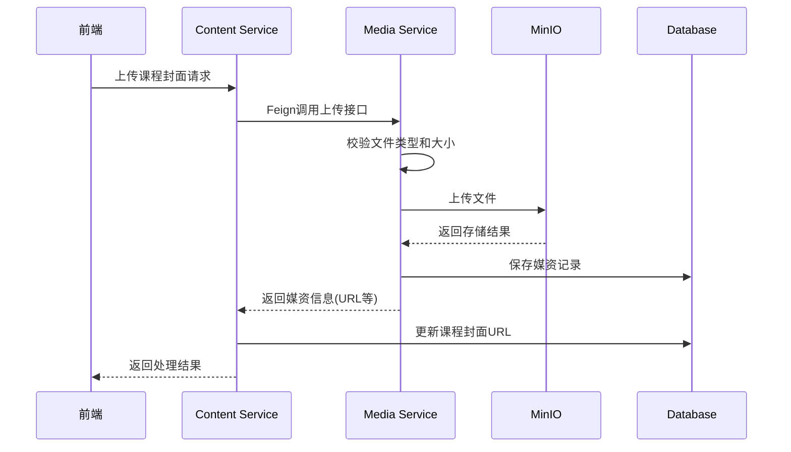
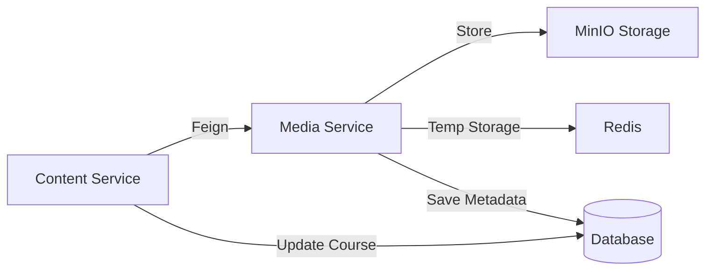
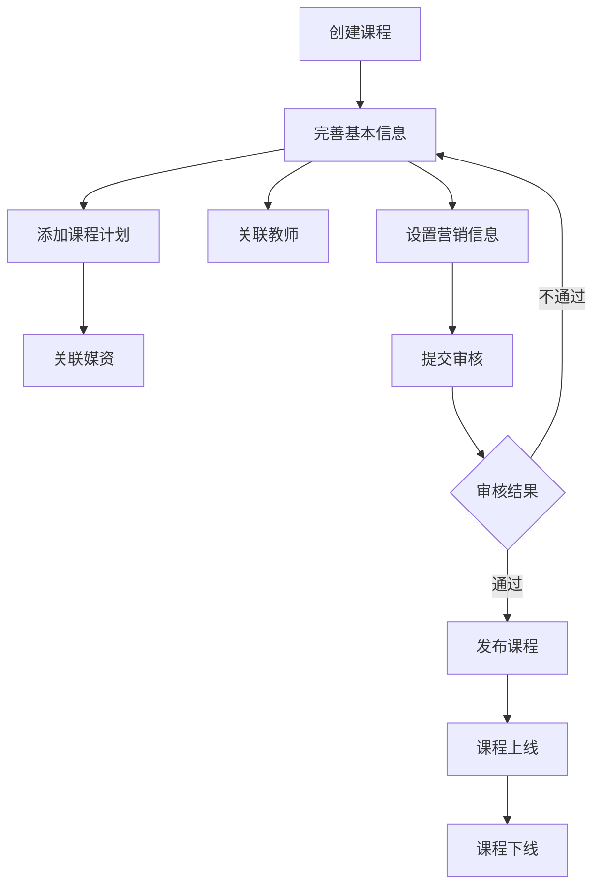
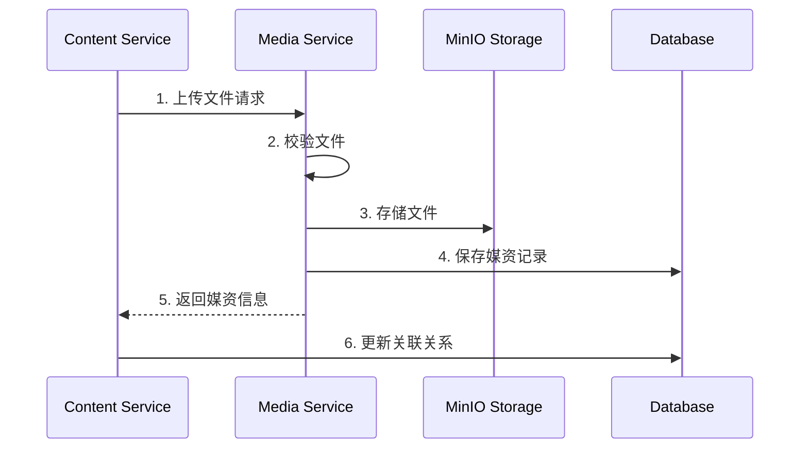

# 内容管理服务(Content Service)文档

## 1. 功能概述

### 1.1 已实现功能
- 课程基本信息管理（CRUD）
  - 课程创建（包含基本信息和营销信息）
  - 课程修改
  - 分页查询（支持多条件筛选）
  - 课程预览
- 课程分类管理
  - 树形结构查询
  - 支持两级分类（大类和小类）
- 课程计划管理
  - 章节管理（一级）
  - 小节管理（二级）
  - 树形结构展示
  - 排序功能
  - 章节上下移动
- 课程教师管理
  - 教师信息的增删改查
  - 支持多个教师
- 课程审核流程
  - 提交审核
  - 审核状态变更
  - 审核意见管理
- 媒资关联管理
  - 媒资绑定到课程计划
  - 支持解除绑定
  - 媒资信息查询
- 课程封面管理
  - 更新课程封面
  - 删除课程封面
  - 与媒资服务集成
  - 跨服务文件管理
- API文档
  - 集成Swagger
  - 详细的接口说明
  - 完整的参数描述

### 1.2 待实现功能
- 课程发布功能
- 课程统计功能
- 课程内容版本控制
- 课程评价管理

## 2. 技术架构

### 2.1 核心技术栈
- Spring Boot 3.x：基础框架
- Spring Data JPA：数据访问层
- ModelMapper：对象映射工具
- MySQL：数据存储
- JUnit 5：单元测试
- Validation：参数校验
- Swagger/OpenAPI：接口文档
- GitHub Actions：CI/CD

### 2.2 项目结构
```angular2html
content_service/
├── controller/ # 控制层，处理HTTP请求
│ ├── CourseController.java
│ ├── TeachplanController.java
│ └── CourseTeacherController.java
├── service/ # 业务层，实现核心逻辑
│ ├── CourseBaseService.java
│ ├── TeachplanService.java
│ └── CourseTeacherService.java
├── repository/ # 数据访问层，与数据库交互
│ ├── CourseBaseRepository.java
│ ├── TeachplanRepository.java
│ └── CourseTeacherRepository.java
├── entity/ # 实体类，映射数据库表
│ ├── CourseBase.java # 课程基本信息
│ ├── CourseMarket.java # 课程营销信息
│ ├── CourseTeacher.java # 课程教师信息
│ └── Teachplan.java # 课程计划
├── dto/ # 数据传输对象
│ ├── request/ # 请求DTO
│ └── response/ # 响应DTO
└── config/ # 配置类
```


## 3. 数据模型设计

### 3.1 核心实体关系
#### CourseBase (课程基本信息)
- 主要属性：
  - id: 课程ID（主键）
  - name: 课程名称
  - brief: 课程简介
  - logo: 课程封面图片URL
  - mt/st: 课程分类（大类/小类）
  - status: 课程状态
  - valid: 是否有效

- 关联关系：
  1. CourseMarket (课程营销信息) - 一对一关系
     - 共享主键，使用课程ID作为关联
     - 级联保存和删除
     - 包含价格、收费方式等营销信息
  
  2. CourseTeacher (课程教师) - 一对多关系
     - 通过course_id外键关联
     - 一个课程可以有多个教师
     - 教师删除不影响课程
  
  3. Teachplan (课程计划) - 一对多关系
     - 通过course_id外键关联
     - 使用parent_id实现树形结构
     - 支持两级结构（章节-小节）
  
  4. CoursePublish (课程发布) - 一对一关系
     - 共享主键，使用课程ID
     - 包含发布状态、发布时间等信息
  
  5. CoursePublishPre (课程预发布) - 一对一关系
     - 共享主键，使用课程ID
     - 用于课程审核流程
     - 包含审核状态、审核意见等信息

#### Teachplan (课程计划)
- 主要属性：
  - id: 计划ID（主键）
  - name: 章节/小节名称
  - courseId: 所属课程ID
  - parentId: 父节点ID
  - level: 层级（1:章节，2:小节）
  - orderBy: 排序号

- 关联关系：
  1. CourseBase - 多对一关系
     - 通过course_id关联到课程
  
  2. TeachplanMedia (媒资关联) - 一对一关系
     - 只有小节（level=2）可以关联媒资
     - 级联删除关系

#### CourseTeacher (课程教师)
- 主要属性：
  - id: 教师ID（主键）
  - courseId: 所属课程ID
  - name: 教师名称
  - position: 职位
  - description: 简介

- 关联关系：
  1. CourseBase - 多对一关系
     - 通过course_id关联到课程
     - 删除课程时级联删除教师

### 3.2 状态定义
- 课程状态：
    - 202001：未发布
    - 202002：已发布
    - 202003：已下线
对应枚举类：CourseStatusEnum

- 审核状态：
    - 202301：已提交审核
    - 202302：审核不通过
    - 202303：审核通过
对应枚举类：CourseAuditStatusEnum

- 收费规则：
    - 201001：免费
    - 201002：收费
对应枚举类：CourseChargeEnum

媒资相关状态：
审核状态（MediaAuditStatusEnum）：
  - 1：未审核
  - 2：审核中
  - 3：审核通过
  - 4：审核不通过

文件状态（MediaStatusEnum）：
  - 1：上传中
  - 2：上传完成
  - 3：上传失败
  - 4：处理中
  - 5：处理成功
  - 6：处理失败

## 4. API接口设计

### 4.1 课程管理接口
#### 4.1.1 课程列表查询
http
GET /course/list
参数：
pageNo: 页码
pageSize: 每页大小
courseName: 课程名称(可选)
status: 课程状态(可选)
mt: 大分类(可选)
st: 小分类(可选)

#### 4.1.2 创建课程
ttp
POST /course
请求体：
{
"name": "课程名称",
"brief": "课程简介",
"mt": 1,
"st": 2,
"charge": "201001",
"price": 0,
"valid": true
}

#### 4.1.4 更新课程封面
```http
POST /course/{courseId}/logo
Content-Type: multipart/form-data

请求参数：
- file: 封面图片文件
- organizationId: 机构ID

响应：
{
  "code": 0,
  "message": "success",
  "data": "http://minio/bucket/course/logo/xxx.jpg"
}
```

#### 4.1.5 删除课程封面
```http
DELETE /course/{courseId}/logo

响应：
{
  "code": 0,
  "message": "success"
}
```

### 4.2 课程计划接口
#### 4.2.1 查询课程计划树
http
GET /teachplan/tree/{courseId}

#### 4.2.2 保存课程计划
http
POST /teachplan
请求体：
{
"courseId": 1,
"parentId": 0,
"name": "章节名称",
"level": 1,
"orderBy": 1
}

## 5. 业务实现细节

### 5.1 课程创建流程
1. 接收AddCourseDTO
2. 验证必要字段
3. 创建CourseBase实体
4. 创建关联的CourseMarket实体
5. 设置初始状态和时间戳
6. 保存到数据库并返回课程ID

### 5.2 课程计划树形结构实现
1. 查询所有课程计划记录
2. 使用Map存储节点引用
3. 遍历记录构建父子关系
4. 返回顶层节点列表

### 5.3 审核流程实现
1. 提交审核
    - 验证课程信息完整性
    - 创建预发布记录
    - 更新审核状态
2. 审核操作
    - 更新审核状态
    - 记录审核意见
    - 触发后续流程

### 5.4 课程封面管理流程



### 服务调用关系



## 6. 测试覆盖

### 6.1 单元测试
- CourseBaseServiceTests
    - 课程CRUD完整流程测试
    - 分类树查询测试
    - 课程预览测试
- TeachplanServiceTests
    - 课程计划CRUD测试
    - 树形结构测试
- CourseTeacherServiceTests
    - 教师管理完整流程测试

### 6.2 HTTP接口测试
- course_test.http
- teachplan_test.http
- teacher_test.http

## 7. 开发规范

### 7.1 代码规范
- 使用构造器注入依赖
- Service层添加@Transactional注解
- Controller层使用统一的参数校验
- 使用ModelMapper进行对象转换
- 统一的日志记录方式

### 7.2 异常处理
- 业务异常统一抛出RuntimeException
- 后续需要完善异常处理机制

### 7.3 日志规范
- 使用@Slf4j注解
- 关键业务操作添加INFO级别日志
- 异常情况记录ERROR级别日志

### 7.4 异常处理规范
- 使用全局异常处理器`GlobalExceptionHandler`
- 业务异常使用`ContentException`统一抛出
- 异常类型包括：
  - 参数校验异常（400）
  - 数据完整性异常（400） 
  - 业务逻辑异常（20001系列）
  - 系统内部异常（500）

## 8. 业务流程说明

### 8.1 课程生命周期管理


1. 课程创建阶段
   - 基本信息录入（名称、简介、分类等）
   - 营销信息设置（收费规则、价格等）
   - 封面图片上传（与媒体服务交互）
   - 数据合法性校验（@Valid注解校验）

2. 课程内容管理
   - 课程计划编排（两级章节结构）
   - 教师关联（支持多个教师）
   - 媒资绑定（图片、视频等）
   - 内容预览（课程预览功能）

3. 课程审核流程
   ```mermaid
   stateDiagram-v2
       [*] --> 未提交: 创建课程
       未提交 --> 已提交: 提交审核
       已提交 --> 审核通过: 审核通过
       已提交 --> 审核不通过: 审核拒绝
       审核不通过 --> 已提交: 修改重提
       审核通过 --> 已发布: 发布课程
       已发布 --> 已下线: 下架课程
   ```

4. 课程发布管理
   - 审核通过后可发布
   - 支持课程上下线
   - 发布信息同步机制
   - 基于版本的内容控制

### 8.2 数据一致性保证

1. 跨服务调用处理


2. 事务管理策略
   - 本地事务：@Transactional
   - 跨服务一致性：最终一致性
   - 补偿机制：失败重试
   - 回滚策略：部分回滚支持

3. 并发控制机制
   - 乐观锁：版本号控制
   - 状态机制：状态流转控制
   - 并发冲突：冲突检测和处理
   - 分布式锁：关键操作保护

### 8.3 业务校验规则

1. 课程创建校验
   - 必填字段：名称、简介、分类等
   - 业务规则：价格范围、图片格式等
   - 数据格式：时间、金额等
   - 权限校验：机构和用户权限

2. 课程发布条件
   - 基本信息完整性
   - 至少一个课程计划
   - 至少一名教师关联
   - 收费课程必须设置价格

### 8.4 异常处理机制

1. 业务异常处理
```java
@RestControllerAdvice
public class GlobalExceptionHandler {
    @ExceptionHandler(ContentException.class)
    public CommonResponse<?> handleContentException(ContentException e) {
        return CommonResponse.error(e.getCode(), e.getMessage());
    }
}
```

2. 服务降级策略
```java
@Component
public class MediaFeignClientFallback implements MediaFeignClient {
    @Override
    public CommonResponse<?> uploadCourseLogo(...) {
        return CommonResponse.error("500", "媒体服务不可用");
    }
}
```

### 8.5 关键监控指标

1. 业务指标监控
   - 课程创建成功率
   - 审核通过率
   - 发布成功率
   - 媒资处理成功率

2. 性能指标监控
   - 接口响应时间
   - 服务调用成功率
   - 资源使用情况
   - 并发处理能力

3. 告警阈值设置
   - 错误率超过5%
   - 响应时间超过1s
   - 服务不可用
   - 存储空间不足

## 9. 微服务架构规划

### 9.1 事件机制
- 课程状态变更事件
  - 发布状态变更
  - 审核状态变更
  - 为消息队列集成做准备
- 操作日志事件
  - 课程操作记录
  - 审核操作记录
- 统计数据事件
  - 访问量统计
  - 学习人数统计

### 9.2 分布式功能
- 分布式锁
  - 课程审核锁
  - 课程发布锁
  - 防止并发操作冲突
- 接口幂等性
  - 重复提交保护
  - 操作日志记录
  - 分布式事务支持
- 媒资服务集成
  - 课程封面上传
  - 封面文件管理
  - 跨服务文件删除

### 9.3 微服务集成
- 媒资服务集成
  - MinIO存储集成
  - 媒资上传接口
  - 媒资处理回调
- 搜索服务集成
  - 课程索引创建
  - 搜索条件优化
  - 数据同步机制
- 任务调度集成
  - 定时统计任务
  - 数据同步任务
  - 缓存更新任务

### 9.4 性能优化规划
- 缓存策略
  - 热门课程缓存
  - 分类数据缓存
  - 统计数据缓存
- 数据库优化
  - 读写分离
  - 分库分表预案
  - 索引优化
- 接口优化
  - 批量操作接口
  - 异步处理机制
  - 限流降级策略

### 9.5 监控告警
- 业务监控
  - 课程发布监控
  - 审核流程监控
  - 关键指标监控
- 性能监控
  - 接口响应时间
  - 资源使用情况
  - 并发处理能力
- 告警机制
  - 错误率告警
  - 响应时间告警
  - 容量预警

## 10. API使用指南

### 10.1 课程管理接口
#### 10.1.1 课程列表查询
GET /course/list
**请求参数：**
- pageNo: 页码（从1开始）
- pageSize: 每页大小
- courseName: 课程名称（可选）
- status: 课程状态（可选）
- mt: 课程大分类（可选）
- st: 课程小分类（可选）

**响应示例：**
json
{
"code": 0,
"message": "success",
"data": {
"items": [
{
"id": 1,
"name": "测试课程",
"brief": "课程简介",
"mtName": "后端开发",
"stName": "Java开发",
"charge": "201001",
"price": 0.00
}
],
"counts": 100,
"page": 1,
"pageSize": 10
}
}
#### 10.1.2 创建课程
http
POST /course

**请求体：**
json
{
"name": "课程名称",
"brief": "课程简介",
"mt": 1,
"st": 2,
"charge": "201001",
"price": 0,
"valid": true
}

**响应示例：**
json
{
"code": 0,
"message": "success",
"data": 1 // 返回课程ID
}

### 10.2 课程计划接口
#### 10.2.1 查询课程计划树
http
GET /teachplan/tree/{courseId}
**响应示例：**
json
{
"code": 0,
"message": "success",
"data": [
{
"id": 1,
"name": "第一章",
"level": 1,
"orderBy": 1,
"teachPlanTreeNodes": [
{
"id": 2,
"name": "第一节",
"level": 2,
"orderBy": 1
}
]
}
]
}
#### 10.2.2 章节移动
http
POST /teachplan/{teachplanId}/moveup // 向上移动
POST /teachplan/{teachplanId}/movedown // 向下移动

**响应示例：**
son
{
"code": 0,
"message": "success",
"data": null
}

### 10.3 课程教师接口
#### 10.3.1 教师列表查询
http
GET /course-teacher/list/{courseId}

**响应示例：**
json
{
"code": 0,
"message": "success",
"data": [
{
"id": 1,
"name": "张老师",
"position": "高级讲师",
"description": "教师简介"
}
]
}
#### 10.3.2 添加/修改教师
**请求体：**
http
POST /course-teacher
json
{
"courseId": 1,
"name": "张老师",
"position": "高级讲师",
"description": "教师简介"
}

### 10.4 课程审核接口
#### 10.4.1 提交审核
http
POST /course/{courseId}/audit/submit
#### 10.4.2 审核课程
http
POST /course/audit
**请求体：**
json
{
"courseId": 1,
"auditStatus": "202303",
"auditMind": "审核通过"
}

### 10.5 媒资关联接口
#### 10.5.1 绑定媒资
http
POST /teachplan-media

**请求体：**
json
{
"teachplanId": 1,
"mediaId": 1,
"mediaFileName": "示例视频.mp4"
}
#### 10.5.2 解除绑定
http
DELETE /teachplan-media/{teachplanId}/{mediaId}
### 10.6 错误码说明
| 错误码 | 说明 |
|--------|------|
| 100101 | 课程不存在 |
| 100102 | 课程名称不能为空 |
| 100103 | 课程分类不存在 |
| 100104 | 课程审核状态错误 |
| 100201 | 课程计划不存在 |
| 100202 | 课程计划层级错误 |
| 100301 | 教师不存在 |
| 200101 | 文件不存在 |
| 200102 | 文件上传失败 |
| 200303 | MinIO上传失败 |
| 299999 | 系统内部错误 |