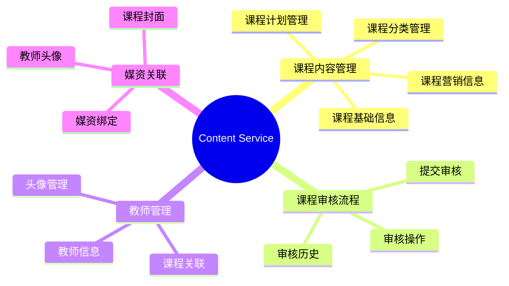
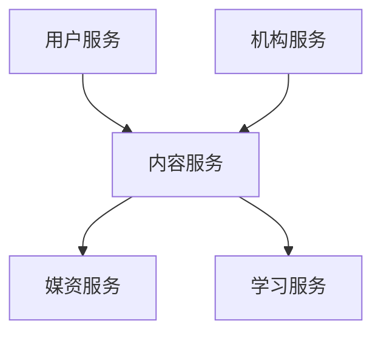
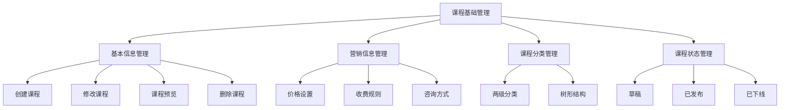
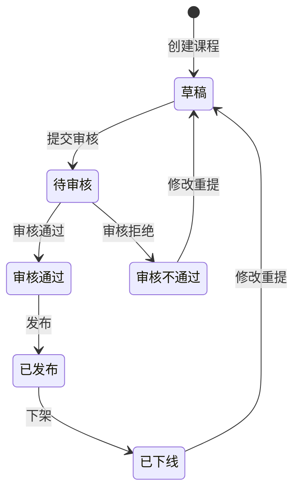
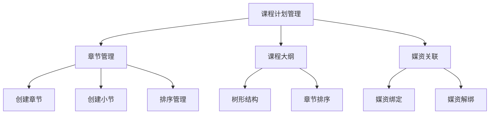
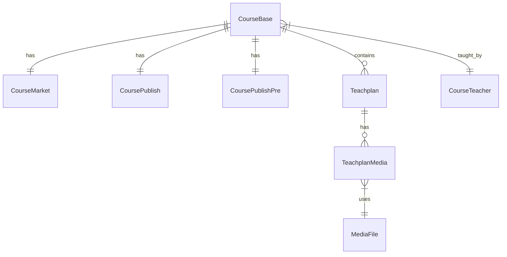
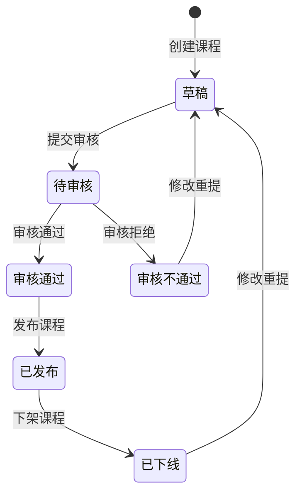
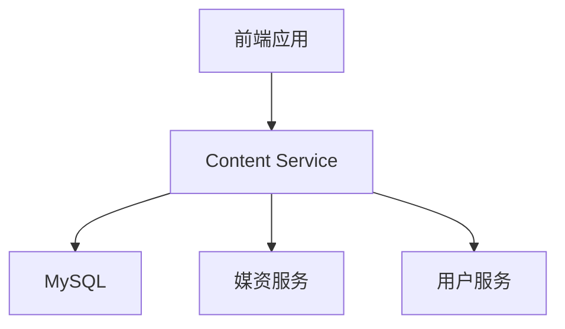
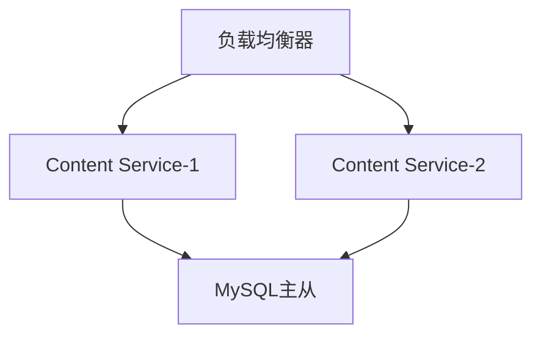

# Content Service 设计文档

## 一、服务概述

### 1.1 服务定位
Content Service(内容服务)是在线课程教学系统的核心服务之一,主要负责课程内容的管理、审核和发布流程。作为课程管理的核心服务,它为机构提供课程管理能力,同时支持平台对课程内容进行规范化管理。

### 1.2 功能概述



### 1.3 业务价值

1. 对机构用户
- 提供完整的课程管理功能
- 支持灵活的课程内容组织
- 简化教师和课程关联管理
- 规范化的审核流程

2. 对平台运营(审核人员)
- 规范的课程审核流程
- 完整的审核历史记录
- 课程质量把控
- 内容管理规范化

### 1.4 系统定位



- 上游依赖:
  - 用户服务: 提供认证和权限
  - 机构服务: 提供机构信息

- 下游服务:
  - 媒资服务: 管理课程相关文件
  - 学习服务: 使用课程内容

### 1.5 关键指标

1. 性能指标
- API响应时间 < 200ms
- 并发处理能力 > 100/s
- 数据库连接数 < 50

2. 可用性指标
- 服务可用性 > 99.9%
- 故障恢复时间 < 5分钟
- 数据一致性 > 99.99%

3. 业务指标
- 课程审核响应 < 24小时
- 课程发布成功率 > 99%
- 教师关联成功率 > 99.9%

## 二、功能模块

### 2.1 课程基础管理模块



#### 2.1.1 基本信息管理
- 课程创建：支持创建课程基本信息和营销信息
- 课程修改：允许修改未发布的课程信息
- 课程预览：提供课程信息预览功能
- 课程删除：支持删除未发布课程，包含强制删除模式

#### 2.1.2 营销信息管理
- 收费规则：支持免费/收费两种模式
- 价格管理：设置课程价格和优惠信息
- 咨询方式：提供QQ等咨询方式配置

### 2.2 课程审核模块



#### 2.2.1 审核流程管理
- 提交审核：课程完善后提交审核
- 审核操作：支持通过/拒绝操作
- 审核记录：记录审核状态变更历史
- 重新提交：支持审核不通过后修改重提

### 2.3 教师管理模块

#### 2.3.1 教师信息管理
- 基础信息：姓名、职位、简介等
- 头像管理：支持上传和更新头像
- 教师列表：分页查询教师信息

#### 2.3.2 教师课程关联
- 关联管理：支持教师与课程多对多关联
- 批量操作：支持批量解除关联
- 权限控制：仅允许操作本机构教师

### 2.4 课程计划模块



#### 2.4.1 章节管理
- 两级结构：支持章(一级)和节(二级)
- 排序功能：支持章节顺序调整
- 批量操作：支持批量更新排序

#### 2.4.2 媒资关联
- 媒资绑定：课程计划关联媒资文件
- 媒资解绑：支持解除媒资关联
- 媒资预览：支持媒资信息预览

## 三、核心领域模型

### 3.1 实体关系图



### 3.2 核心实体

#### 3.2.1 CourseBase (课程基本信息)
- 主要属性
  - id: 课程ID(主键)
  - name: 课程名称
  - brief: 课程简介
  - logo: 课程封面URL
  - mt/st: 课程分类(大类/小类)
  - status: 课程状态
  - organizationId: 机构ID
  - valid: 课程有效性标识

- 关联关系
  - 一对一: CourseMarket (营销信息)
  - 一对一: CoursePublish (发布信息)
  - 一对一: CoursePublishPre (预发布信息)
  - 一对多: Teachplan (课程计划)
  - 多对多: CourseTeacher (课程教师)

#### 3.2.2 CourseMarket (课程营销信息)
- 主要属性
  - id: 与课程ID相同(共享主键)
  - charge: 收费规则
  - price: 现价
  - priceOld: 原价
  - discounts: 优惠信息

- 关联关系
  - 一对一: CourseBase (使用@MapsId共享主键)

#### 3.2.3 CourseTeacher (课程教师)
- 主要属性
  - id: 教师ID
  - name: 教师名称
  - position: 职位
  - organizationId: 机构ID
  - description: 教师简介
  - avatar: 教师头像URL

- 关联关系
  - 多对多: CourseBase (通过中间表关联)

#### 3.2.4 Teachplan (课程计划)
- 主要属性
  - id: 计划ID
  - name: 计划名称
  - parentId: 父节点ID
  - level: 层级(1:章节,2:小节)
  - orderBy: 排序号

- 关联关系
  - 多对一: CourseBase
  - 一对多: TeachplanMedia
  - 树形结构: 通过parentId自关联

#### 3.2.5 TeachplanMedia (课程计划媒资)
- 主要属性
  - id: 主键
  - teachplanId: 课程计划ID
  - mediaId: 媒资文件ID

- 关联关系
  - 多对一: Teachplan
  - 多对一: MediaFile

### 3.3 状态定义

#### 3.3.1 课程状态(CourseStatus)
- DRAFT("202001"): 草稿
- PUBLISHED("202002"): 已发布
- OFFLINE("202003"): 已下线

#### 3.3.2 审核状态(CourseAuditStatus)
- SUBMITTED("202301"): 已提交
- APPROVED("202302"): 审核通过
- REJECTED("202303"): 审核不通过

### 3.4 设计规范

1. 主键策略
   - CourseBase: 自增主键
   - CourseMarket/CoursePublish/CoursePublishPre: 与CourseBase共享主键
   - 其他实体: 自增主键

2. 时间字段
   - 统一使用LocalDateTime类型
   - 必备字段: createTime, updateTime
   - 使用@PrePersist和@PreUpdate自动管理
   - 时区统一配置为UTC

3. 关联关系
   - 使用懒加载(FetchType.LAZY)
   - 双向关联时使用@ToString.Exclude
   - 级联操作需要明确定义
   - 多对多关系使用中间表

## 四、关键流程设计

### 4.1 课程生命周期管理



#### 4.1.1 课程创建流程
1. 基础信息录入
   - 课程名称、简介、分类等基本信息
   - 课程封面上传(两阶段上传)
   - 营销信息设置(收费规则、价格等)
   - 数据校验(@Valid注解)

2. 课程内容编排
   - 课程计划(章节结构)
   - 教师关联
   - 媒资绑定
   - 内容预览

#### 4.1.2 课程审核流程
1. 提交审核
   - 校验课程信息完整性
   - 创建预发布记录(CoursePublishPre)
   - 更新课程状态

2. 审核操作
   - 审核通过/拒绝
   - 记录审核意见
   - 状态流转

3. 课程发布
   - 创建发布记录(CoursePublish)
   - 更新课程状态
   - 内容同步

### 4.2 课程删除流程

#### 4.2.1 普通删除流程
1. 前置校验
   - 检查课程状态(已发布课程不能删除)
   - 检查教师关联(存在关联时抛出异常)
   - 检查课程计划(存在计划时抛出异常)

2. 删除操作
   - 删除课程封面
   - 删除课程基本信息
   - 删除营销信息(级联)

#### 4.2.2 强制删除流程
1. 前置校验
   - 检查课程状态(已发布课程不能删除)

2. 删除操作
   - 解除所有教师关联
   - 删除所有课程计划
   - 删除课程封面
   - 删除课程基本信息及关联信息

### 4.3 课程计划管理流程

#### 4.3.1 章节排序优化
1. 两阶段提交
   - 移动操作(moveUp/moveDown)只更新内存缓存
   - 确认后批量更新数据库
   - 支持撤销未保存的变更

2. 缓存设计
   - 使用ConcurrentHashMap存储临时排序
   - 提供批量保存和撤销操作
   - 保证并发安全

3. 异常处理
   - 首节点上移
   - 末节点下移
   - 节点不存在
   - 并发冲突

### 4.4 媒资关联流程

#### 4.4.1 课程封面管理
1. 上传流程
   - 临时上传到媒资服务
   - 获取临时存储key
   - 确认后永久保存
   - 更新课程封面URL

2. 删除流程
   - 获取当前封面URL
   - 调用媒资服务删除文件
   - 清空课程封面URL

#### 4.4.2 课程计划媒资绑定
1. 绑定流程
   - 校验媒资文件存在
   - 创建绑定关系
   - 更新课程计划

2. 解绑流程
   - 删除绑定关系
   - 更新课程计划

### 4.5 数据一致性保证

1. 事务管理
   - @Transactional注解
   - 合理设置事务传播级别
   - 异常回滚处理

2. 跨服务调用
   - Feign降级处理
   - 补偿机制
   - 状态同步

3. 并发控制（未实现）
   - 乐观锁(@Version)
   - 悲观锁(适用场景)
   - 分布式锁(跨服务)

## 五、技术架构

### 5.1 系统架构



#### 5.1.1 核心组件
1. 应用服务层
   - Spring Boot
   - Spring Data JPA
   - OpenAPI/Swagger
   - ModelMapper

2. 数据存储层
   - MySQL: 核心业务数据
   - JPA: ORM框架

3. 服务调用
   - OpenFeign: 调用媒资服务
   - 服务间同步调用

### 5.2 技术选型

#### 5.2.1 基础框架
- Spring Boot: 应用基础框架
- Spring Data JPA: 数据访问层
- ModelMapper: 对象映射工具
- Validation: 参数校验

#### 5.2.2 依赖组件
```xml
<dependencies>
    <!-- Web -->
    <dependency>
        <groupId>org.springframework.boot</groupId>
        <artifactId>spring-boot-starter-web</artifactId>
    </dependency>

    <!-- 数据库 -->
    <dependency>
        <groupId>com.mysql</groupId>
        <artifactId>mysql-connector-j</artifactId>
    </dependency>
    <dependency>
        <groupId>org.springframework.boot</groupId>
        <artifactId>spring-boot-starter-data-jpa</artifactId>
    </dependency>

    <!-- API文档 -->
    <dependency>
        <groupId>org.springdoc</groupId>
        <artifactId>springdoc-openapi-starter-webmvc-ui</artifactId>
        <version>2.3.0</version>
    </dependency>
    <dependency>
        <groupId>org.springdoc</groupId>
        <artifactId>springdoc-openapi-starter-webmvc-api</artifactId>
        <version>2.3.0</version>
    </dependency>

    <!-- 测试 -->
    <dependency>
        <groupId>org.springframework.boot</groupId>
        <artifactId>spring-boot-starter-test</artifactId>
        <scope>test</scope>
    </dependency>
</dependencies>
```

#### 5.2.3 开发工具
- Maven: 项目构建工具
- Git: 版本控制
- JUnit5: 单元测试
- Swagger/OpenAPI: 接口文档

### 5.3 部署架构



#### 5.3.1 部署方案
1. 服务部署
   - 支持多实例部署
   - 负载均衡
   - 服务注册与发现(待实现)

2. 数据库部署
   - MySQL主从架构
   - 数据备份策略
   - 定期维护计划

3. 监控方案
   - 服务健康检查
   - 性能监控
   - 日志收集

## 六、接口设计

### 6.1 API接口规范

#### 6.1.1 统一响应格式
```json
{
    "code": 200,
    "message": "success",
    "data": {}
}
```

#### 6.1.2 接口文档规范
- 使用OpenAPI 3.0规范
- 每个接口都有详细的描述
- 请求/响应参数都有说明
- 使用Tag对接口分组

### 6.2 核心接口

#### 6.2.1 课程管理接口 (CourseController)
```http
# 课程基本信息管理
POST    /course                          # 创建课程
PUT     /course                          # 更新课程
GET     /course/{courseId}               # 获取课程详情
DELETE  /course/{courseId}               # 删除课程
GET     /course/preview/{courseId}       # 课程预览

# 课程分类
GET     /course/category/tree            # 获取课程分类树

# 课程查询
GET     /course/list                     # 查询已审核课程
GET     /course/admin/list               # 管理员查询课程列表
GET     /course/organization/{orgId}     # 查询机构课程列表

# 课程封面
POST    /course/{courseId}/logo/temp     # 上传临时封面
POST    /course/{courseId}/logo/confirm  # 确认封面
DELETE  /course/{courseId}/logo          # 删除封面
```

#### 6.2.2 课程审核接口 (CourseAuditController)
```http
# 审核流程
POST    /course-audit/submit/{courseId}  # 提交审核
POST    /course-audit/approve            # 审核操作

# 审核记录
GET     /course-audit/pending            # 待审核列表
GET     /course-audit/history/{courseId} # 课程审核历史
GET     /course-audit/history/auditor/{auditorId} # 审核人历史
```

#### 6.2.3 教师管理接口 (CourseTeacherController)
```http
# 教师管理
GET     /course-teacher/organization/{orgId}/teachers      # 机构教师列表
POST    /course-teacher/organization/{orgId}/teachers      # 保存教师
GET     /course-teacher/organization/{orgId}/teachers/{id} # 教师详情
DELETE  /course-teacher/organization/{orgId}/teachers/{id} # 删除教师

# 教师课程关联
GET     /course-teacher/courses/{courseId}/teachers        # 课程教师列表
GET     /course-teacher/teachers/{teacherId}/courses       # 教师课程列表
POST    /course-teacher/organization/{orgId}/courses/{courseId}/teachers/{teacherId}   # 关联教师
DELETE  /course-teacher/organization/{orgId}/courses/{courseId}/teachers/{teacherId}   # 解除关联

# 教师头像
POST    /course-teacher/{teacherId}/avatar/temp     # 上传临时头像
POST    /course-teacher/{teacherId}/avatar/confirm  # 确认头像
DELETE  /course-teacher/{teacherId}/avatar          # 删除头像
```

#### 6.2.4 课程计划接口 (TeachplanController)
```http
# 课程计划管理
POST    /teachplan                       # 保存课程计划
GET     /teachplan/tree/{courseId}       # 获取课程计划树
DELETE  /teachplan/{teachplanId}         # 删除课程计划

# 计划排序
POST    /teachplan/moveup/{teachplanId}  # 上移
POST    /teachplan/movedown/{teachplanId} # 下移
POST    /teachplan/saveorder             # 保存排序
POST    /teachplan/discardorder          # 丢弃排序

# 媒资关联
POST    /teachplan/media                 # 绑定媒资
DELETE  /teachplan/media/{teachplanId}/{mediaId} # 解除绑定
```

### 6.3 数据传输对象(DTO)

#### 6.3.1 课程管理DTO
- CourseBaseDTO: 课程基本信息
  - id: 课程ID
  - name: 课程名称
  - brief: 课程简介
  - status: 课程状态
  - organizationId: 机构ID

- AddCourseDTO: 新增课程请求
  - name: 课程名称(必填)
  - brief: 课程简介(必填)
  - mt/st: 课程分类(必填)
  - charge: 收费规则(必填)

- EditCourseDTO: 编辑课程请求
  - id: 课程ID(必填)
  - name: 课程名称
  - brief: 课程简介
  - price: 课程价格

#### 6.3.2 课程计划DTO
- TeachplanDTO: 课程计划树节点
  - id: 节点ID
  - name: 节点名称
  - parentId: 父节点ID
  - orderBy: 排序号
  - children: 子节点列表

- SaveTeachplanDTO: 保存课程计划
  - courseId: 课程ID(必填)
  - parentId: 父节点ID(必填)
  - name: 计划名称(必填)
  - level: 层级(必填)

#### 6.3.3 教师管理DTO
- CourseTeacherDTO: 教师信息
  - id: 教师ID
  - name: 教师名称
  - position: 职位
  - courseIds: 关联课程ID列表

- SaveCourseTeacherDTO: 保存教师
  - name: 教师名称(必填)
  - position: 职位(必填)
  - description: 简介

### 6.4 错误码设计

#### 6.4.1 错误码结构
错误码为6位数字,格式为: `1XXYXX`
- 1: 固定前缀,表示内容服务
- XX: 模块编号
- Y: 子模块编号
- XX: 具体错误编号

#### 6.4.2 模块划分
- 001: 课程基础模块
- 002: 课程计划模块
- 003: 教师模块
- 004: 媒资模块
- 005: 课程封面模块
- 006: 权限模块
- 999: 系统错误

#### 6.4.3 错误码列表

1. 课程相关错误 (1001xx)
```
COURSE_NOT_EXISTS(100101, "课程不存在")
COURSE_NAME_EMPTY(100102, "课程名称不能为空")
COURSE_CATEGORY_NOT_EXISTS(100103, "课程分类不存在")
COURSE_AUDIT_STATUS_ERROR(100106, "课程审核状态错误")
COURSE_STATUS_ERROR(100105, "课程状态错误")
COURSE_PUBLISH_ERROR(100106, "课程发布失败")
COURSE_ORG_NOT_MATCH(100106, "课程与机构不匹配")
```

2. 课程计划相关错误 (1002xx)
```
TEACHPLAN_NOT_EXISTS(100201, "课程计划不存在")
TEACHPLAN_LEVEL_ERROR(100202, "课程计划层级错误")
TEACHPLAN_DELETE_ERROR(100203, "课程计划包含子节点，无法删除")
TEACHPLAN_MOVE_ERROR(100204, "课程计划移动失败")
TEACHPLAN_SAVE_ERROR(100205, "课程计划保存失败")
```

3. 教师相关错误 (1003xx)
```
TEACHER_NOT_EXISTS(100301, "教师不存在")
TEACHER_COURSE_NOT_MATCH(100302, "教师与课程不匹配")
COURSE_HAS_TEACHER(40010, "课程存在教师关联")
COURSE_DELETE_TEACHER_FAILED(40011, "解除课程教师关联失败")
```

4. 媒资相关错误 (1004xx)
```
MEDIA_NOT_EXISTS(100401, "媒资文件不存在")
MEDIA_BIND_ERROR(100402, "媒资绑定失败")
MEDIA_ORG_NOT_MATCH(100403, "媒资文件不属于该机构")
MEDIA_TYPE_NOT_SUPPORT(100404, "不支持的媒体类型")
MEDIA_ALREADY_EXISTS(100405, "媒资文件已存在")
MEDIA_DELETE_ERROR(100406, "删除媒资文件失败")
MEDIA_SERVICE_ERROR(100407, "媒体服务不可用")
```

5. 课程封面相关错误 (1005xx)
```
UPLOAD_LOGO_FAILED(100501, "上传课程封面失败")
DELETE_LOGO_FAILED(100502, "删除课程封面失败")
LOGO_NOT_EXISTS(100503, "课程封面不存在")
```

6. 权限相关错误 (1006xx)
```
PERMISSION_DENIED(100601, "没有操作权限")
```

7. 参数相关错误
```
PARAMS_ERROR(100100, "参数错误")
PARAMS_EMPTY(100101, "必填参数为空")
PARAMS_INVALID(100102, "参数格式不正确")
```

8. 系统错误 (1999xx)
```
SYSTEM_ERROR(199999, "系统内部错误")
```

#### 6.4.4 错误处理原则
1. 业务异常统一使用 ContentException
2. 错误码必须使用 ContentErrorCode 中定义的常量
3. 异常信息要准确描述错误原因
4. 敏感信息不允许在错误信息中返回
5. 所有异常都应该被记录日志

## 七、安全设计(建议方案)

### 7.1 权限模型
1. 基于RBAC的权限模型
   - 用户-角色-权限三层结构
   - 支持角色继承
   - 权限粒度到接口级别

2. 数据权限
   - 机构数据隔离
   - 基于organizationId的数据过滤
   - 管理员可跨机构访问

3. 接口权限
   - 基于Spring Security实现
   - JWT token认证
   - 接口级别的权限控制

## 八、性能设计

### 8.1 缓存策略
1. 内存缓存(已实现)
   ```java
   @Component
   public class TeachplanOrderCache {
       // 使用ConcurrentHashMap实现课程计划排序的内存缓存
       private final Map<Long, Integer> orderCache = new ConcurrentHashMap<>();
       
       // 支持批量保存和撤销操作
       public void saveAllChanges() {
           // ...
       }
   }
   ```

2. 分布式缓存(建议方案)
   - 使用Redis缓存热点数据
   - 课程基本信息缓存
   - 课程计划树缓存
   - 合理的缓存更新策略

### 8.2 查询优化(建议方案)
1. 索引优化
   - 合理设计索引
   - 避免索引失效
   - 定期维护索引

2. 分页查询优化
   - 使用游标分页
   - 避免深分页问题
   - 合理的分页大小

### 8.3 并发处理(建议方案)
1. 乐观锁
   - 版本号控制
   - 适用于并发冲突少的场景

2. 分布式锁
   - 使用Redis实现
   - 适用于跨服务的并发控制

## 九、测试策略

### 9.1 单元测试(已实现)
1. Repository层测试
```java
@SpringBootTest
@Transactional
class CourseBaseRepositoryTest {
    @Test
    void testSaveCourse() {
        // 测试课程保存
    }
    
    @Test
    void testFindByConditions() {
        // 测试条件查询
    }
}
```

2. Service层测试
```java
@SpringBootTest
@Transactional
class CourseBaseServiceTest {
    @Test
    void testCreateCourse() {
        // 测试课程创建
    }
    
    @Test
    void testUpdateCourse() {
        // 测试课程更新
    }
}
```

3. Utils测试
```java
class TreeUtilsTest {
    @Test
    void buildTree_WithValidData_ShouldCreateCorrectTree() {
        // 测试树形结构构建
    }
}
```

### 9.2 集成测试(建议方案)
1. 接口测试
   - REST API测试
   - 请求参数验证
   - 响应结果验证

2. 流程测试
   - 课程发布流程
   - 课程审核流程
   - 教师关联流程

### 9.3 性能测试(建议方案)
1. 压力测试
   - 并发用户数
   - 响应时间
   - 系统吞吐量

2. 稳定性测试
   - 长时间运行
   - 内存泄漏检测
   - 数据库连接池

## 十、部署运维(建议方案)

### 10.1 部署方案
1. 容器化部署
   - 使用Docker容器
   - Kubernetes编排
   - 支持水平扩展

2. 高可用设计
   - 服务多实例
   - 数据库主从
   - 负载均衡

### 10.2 监控方案
1. 系统监控
   - CPU/内存使用率
   - 磁盘IO
   - 网络流量

2. 应用监控
   - 接口响应时间
   - 异常统计
   - JVM监控

3. 业务监控
   - 课程发布数量
   - 审核通过率
   - 教师关联数

### 10.3 运维建议
1. 日志管理
   - ELK日志收集
   - 日志分级策略
   - 关键操作审计

2. 备份策略
   - 数据库定时备份
   - 文件系统备份
   - 灾备演练

3. 应急预案
   - 服务降级方案
   - 数据恢复方案
   - 故障转移方案
