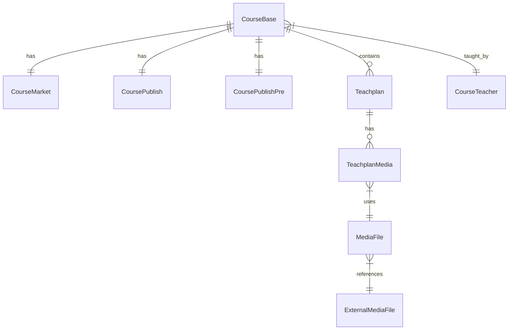

# Content Service 实体关系说明

## 核心实体

### 1. CourseBase (课程基本信息)
- 主要字段:
  - id: 课程ID
  - name: 课程名称
  - brief: 课程简介
  - logo: 课程封面图片URL
  - mt/st: 课程分类(大类/小类)
  - status: 课程状态
  - organizationId: 机构ID
  - qq: 咨询QQ
  - valid: 课程有效性标识，true表示有效，false表示已删除

- 关联关系:
  - 一对一 CourseMarket (共享主键)
  - 一对多 Teachplan (通过course_id关联)
  - 一对多 CourseTeacher (通过course_id关联)
  - 与CoursePublish/CoursePublishPre的关联需要补充实体类

### 2. CourseMarket (课程营销信息)
- 主要字段:
  - id: 与课程ID相同
  - charge: 收费规则
  - price: 现价
  - priceOld: 原价
  - discounts: 优惠信息
  
- 关联关系:
  - 一对一 CourseBase (课程基本信息)
  - 使用@MapsId共享主键

### 3. CourseTeacher (课程教师)
- 主要字段:
  - id: 教师ID
  - name: 教师名称
  - position: 职位
  - organizationId: 机构ID
  
- 关联关系:
  - 多对多 CourseBase (课程基本信息)
  - 使用中间表course_teacher_relation维护关系

### 4. Teachplan (课程计划)
- 主要字段:
  - id: 计划ID
  - name: 计划名称
  - parentId: 父节点ID
  - level: 层级(1:章节,2:小节)
  - orderBy: 排序号
  
- 关联关系:
  - 多对一 CourseBase (课程基本信息)
  - 一对多 TeachplanMedia (课程计划媒资)
  - 树形结构(通过parentId)

### 5. TeachplanMedia (课程计划媒资)
- 主要字段:
  - id: 主键
  - teachplanId: 课程计划ID
  - mediaId: 媒资文件ID
  
- 关联关系:
  - 多对一 Teachplan (课程计划)
  - 多对一 MediaFile (媒资文件)

### 6. CoursePublish (课程发布)
- 主要字段:
  - id: 与课程ID相同
  - name: 课程名称
  - status: 发布状态
  - publishTime: 发布时间
  
- 关联关系:
  - 一对一 CourseBase (课程基本信息)
  - 使用@MapsId共享主键

### 7. CoursePublishPre (课程预发布)
- 主要字段:
  - id: 与课程ID相同
  - name: 课程名称
  - status: 审核状态
  - previewTime: 预览时间
  
- 关联关系:
  - 一对一 CourseBase (课程基本信息)
  - 使用@MapsId共享主键

### 8. MediaFile (媒资文件)
- 主要字段:
  - mediaFileId: 主键，与media服务的fileId对应
  - organizationId: 机构ID
  - fileName: 文件名称
  - mediaType: 媒体类型(IMAGE/VIDEO)
  - auditStatus: 审核状态
  - url: 访问地址
  - purpose: 文件用途(COVER/VIDEO)
  
- 关联关系:
  - 一对多 TeachplanMedia (课程计划媒资)
  - 与media服务通过mediaFileId关联

## 实体关系图


## 关键设计说明

1. 主键策略
- CourseBase: 自增主键
- CourseMarket/CoursePublish/CoursePublishPre: 与CourseBase共享主键
- 其他实体: 自增主键

2. 懒加载配置
- 所有多对一、一对多关系默认使用懒加载
- 使用@ToString.Exclude和@EqualsAndHashCode.Exclude避免循环引用

3. 级联操作
- CourseBase -> CourseMarket: 级联所有操作
- CourseBase -> Teachplan: 级联所有操作
- Teachplan -> TeachplanMedia: 级联所有操作

4. 数据完整性
- 必填字段使用@Column(nullable = false)
- 使用外键约束确保关联数据完整性
- 使用@JoinColumn指定外键列

5. 审计字段
- 所有实体包含createTime和updateTime
- 部分实体包含valid字段标识有效性

6. 树形结构
- Teachplan通过parentId实现树形结构
- 支持两级结构:章节和小节

7. 枚举使用规范
- 所有状态字段必须使用枚举类型
- 持久化时存储枚举的code值（字符串类型）
- 示例：
  ```java
  @Enumerated(EnumType.STRING)
  @Column(length = 20)
  private CourseStatusEnum status;
  ```
- 前端交互使用code值，后端转换枚举处理

## Service层说明

### 1. CourseBaseService (课程基础服务)
- 主要功能：
  - 课程的CRUD操作
  - 课程分页查询
  - 课程分类树查询
  - 课程预览
  - 课程审核流程管理
  - 课程发布管理

- 关键方法：
  ```java
  // 创建课程
  Long createCourse(AddCourseDTO addCourseDTO);
  
  // 分页查询课程
  PageResult<CourseBaseDTO> queryCourseList(PageParams params, QueryCourseParamsDTO queryParams);
  
  // 课程预览
  CoursePreviewDTO preview(Long courseId);
  
  // 提交审核
  void submitForAudit(Long courseId);
  
  // 审核课程
  void auditCourse(CourseAuditDTO auditDTO);
  ```

### 2. TeachplanService (课程计划服务)
- 主要功能：
  - 课程计划的CRUD操作
  - 课程计划树形结构管理
  - 课程计划排序管理

- 关键方法：
  ```java
  // 查询课程计划树
  List<TeachplanDTO> findTeachplanTree(Long courseId);
  
  // 保存课程计划
  void saveTeachplan(SaveTeachplanDTO teachplanDTO);
  
  // 课程计划排序
  void moveUp(Long teachplanId);
  void moveDown(Long teachplanId);
  ```

### 3. CourseTeacherService (课程教师服务)
- 主要功能：
  - 教师信息管理
  - 教师与课程关联管理
  - 按机构查询教师

- 关键方法：
  ```java
  // 查询课程教师
  List<CourseTeacherDTO> listByCourseId(Long courseId);
  
  // 查询机构教师
  List<CourseTeacherDTO> listByOrganizationId(Long organizationId);
  
  // 教师课程管理
  void saveCourseTeacher(SaveCourseTeacherDTO teacherDTO);
  void deleteCourseTeacher(Long courseId, Long teacherId);
  ```

### 4. TeachplanMediaService (课程计划媒资服务)
- 主要功能：
  - 媒资绑定管理
  - 媒资关联查询

- 关键方法：
  ```java
  // 媒资绑定
  void associateMedia(TeachplanMediaDTO teachplanMediaDTO);
  
  // 解除绑定
  void dissociateMedia(Long teachplanId, Long mediaId);
  ```

### 5. MediaFileService (媒资文件服务)
- 主要功能：
  - 媒资文件信息管理
  - 媒资文件审核状态管理
  - 媒资文件访问控制

- 关键方法：
  ```java
  // 保存媒资文件信息
  MediaFile saveMediaFile(Long organizationId, MediaFileDTO mediaFileDTO);
  
  // 分页查询媒资文件
  PageResult<MediaFileDTO> queryMediaFiles(Long organizationId, String mediaType, String purpose, PageParams pageParams);
  
  // 获取媒资文件访问地址
  String getMediaFileUrl(Long organizationId, String mediaFileId);
  
  // 更新审核状态
  void updateAuditStatus(String mediaFileId, String auditStatus, String auditMessage);
  ```

## DTO说明

### 1. 课程相关DTO
- AddCourseDTO：课程创建数据传输对象
  ```java
  private String name;        // 课程名称
  private String brief;       // 课程简介
  private Long mt;           // 课程大分类
  private Long st;           // 课程小分类
  private String charge;     // 收费规则
  private BigDecimal price;  // 课程价格
  ```

- CourseBaseDTO：课程基本信息DTO
  ```java
  private Long id;           // 课程ID
  private String name;       // 课程名称
  private String status;     // 课程状态
  private String mtName;     // 大分类名称
  private String stName;     // 小分类名称
  ```

- CoursePreviewDTO：课程预览DTO
  ```java
  private CourseBaseDTO courseBase;           // 基本信息
  private List<TeachplanDTO> teachplans;      // 课程计划
  private List<CourseTeacherDTO> teachers;    // 课程教师
  ```

### 2. 教师相关DTO
- CourseTeacherDTO：课程教师DTO
  ```java
  private Long id;              // 教师ID
  private String name;          // 教师名称
  private String position;      // 职位
  private Set<Long> courseIds;  // 关联课程ID
  ```

- SaveCourseTeacherDTO：保存教师DTO
  ```java
  private Long organizationId;  // 机构ID
  private String name;          // 教师名称
  private Set<Long> courseIds;  // 关联课程ID
  ```

### 3. 课程计划相关DTO
- TeachplanDTO：课程计划DTO
  ```java
  private Long id;                          // 计划ID
  private String name;                      // 计划名称
  private Integer level;                    // 层级
  private List<TeachplanDTO> teachPlanTreeNodes;  // 子节点
  ```

- SaveTeachplanDTO：保存课程计划DTO
  ```java
  private Long courseId;    // 课程ID
  private String name;      // 计划名称
  private Long parentId;    // 父节点ID
  private Integer level;    // 层级
  ```

### 4. 查询相关DTO
- QueryCourseParamsDTO：课程查询参数DTO
  ```java
  private String courseName;     // 课程名称
  private String status;         // 课程状态
  private Long organizationId;   // 机构ID
  ```

- CourseCategoryTreeDTO：课程分类树DTO
  ```java
  private Long id;              // 分类ID
  private String name;          // 分类名称
  private List<CourseCategoryTreeDTO> childrenTreeNodes;  // 子节点
  ```

### 5. 审核相关DTO
- CourseAuditDTO：课程审核DTO
  ```java
  private Long courseId;     // 课程ID
  private String auditStatus; // 审核状态
  private String auditMessage;// 审核意见
  ```

## 业务流程说明

### 1. 课程发布流程
1. 创建课程基本信息
2. 添加课程营销信息
3. 设置课程计划
4. 关联课程教师
5. 提交课程审核
6. 审核通过后发布

### 2. 课程计划管理
1. 创建课程章节
2. 在章节下创建小节
3. 调整章节和小节顺序
4. 关联媒资文件

### 3. 教师管理
1. 创建教师信息
2. 关联教师与课程
3. 管理教师课程关系

### 4. 媒资文件管理流程
1. 文件上传流程
   - 用户通过media服务上传文件
   - media服务处理并返回mediaFileId
   - content服务保存媒资信息
   - 根据mediaType设置默认审核状态

2. 文件访问流程
   - 图片类型：直接返回url
   - 视频类型：需要通过media服务获取临时访问地址

3. 审核流程
   - 图片默认通过审核（状态直接设为3-审核通过）
   - 视频需要经过审核（初始状态为1-未审核）
   - 审核状态转换：
     - 提交审核 → 2（审核中）
     - 审核通过 → 3（审核通过）
     - 审核不通过 → 4（审核不通过）
   - 状态变更通过消息队列接收审核结果

## Controller层说明

### 1. CourseController (课程管理接口)
- 基础路径: `/course`
- 主要接口:
  ```
  GET  /list                    # 分页查询课程列表
  POST /                        # 创建课程
  PUT  /                        # 修改课程
  GET  /{courseId}             # 获取课程详情
  GET  /category/tree          # 获取课程分类树
  GET  /preview/{courseId}     # 课程预览
  POST /{courseId}/audit/submit # 提交课程审核
  POST /audit                  # 审核课程
  POST /{courseId}/publish     # 发布课程
  POST /{courseId}/offline     # 下架课程
  ```

- 关键接口说明:
  1. 分页查询课程列表
     - 请求参数：
       ```json
       {
         "pageNo": 1,
         "pageSize": 10,
         "courseName": "课程名称",
         "status": "课程状态",
         "organizationId": 1234
       }
       ```
     - 返回结果：
       ```json
       {
         "items": [{
           "id": 1,
           "name": "课程名称",
           "brief": "课程简介",
           "status": "202001"
         }],
         "counts": 100,
         "page": 1,
         "pageSize": 10
       }
       ```

  2. 创建课程
     - 请求体：
       ```json
       {
         "name": "课程名称",
         "brief": "课程简介",
         "mt": 1,
         "st": 2,
         "charge": "201001",
         "price": 0,
         "organizationId": 1234
       }
       ```
     - 返回结果：课程ID

### 2. TeachplanController (课程计划管理接口)
- 基础路径: `/teachplan`
- 主要接口:
  ```
  GET    /tree/{courseId}      # 查询课程计划树
  POST   /                     # 创建/修改课程计划
  DELETE /{teachplanId}        # 删除课程计划
  POST   /moveup/{teachplanId} # 上移课程计划
  POST   /movedown/{teachplanId} # 下移课程计划
  POST   /media               # 绑定媒资
  DELETE /media/{teachplanId}/{mediaId} # 解除媒资绑定
  ```

- 关键接口说明:
  1. 查询课程计划树
     - 返回结果：
       ```json
       [{
         "id": 1,
         "name": "第一章",
         "level": 1,
         "teachPlanTreeNodes": [{
           "id": 2,
           "name": "第一节",
           "level": 2
         }]
       }]
       ```

  2. 创建课程计划
     - 请求体：
       ```json
       {
         "courseId": 1,
         "parentId": 0,
         "name": "第一章",
         "level": 1,
         "orderBy": 1
       }
       ```

### 3. CourseTeacherController (课程教师管理接口)
- 基础路径: `/course-teacher`
- 主要接口:
  ```
  GET    /list/{courseId}              # 查询课程教师列表
  GET    /{organizationId}/{teacherId} # 查询教师详情
  GET    /courses/{teacherId}          # 查询教师关联的课程
  GET    /organization/{organizationId} # 查询机构教师列表
  POST   /                             # 添加/修改教师
  DELETE /{courseId}/{teacherId}       # 解除教师与课程关联
  ```

- 关键接口说明:
  1. 添加/修改教师
     - 请求体：
       ```json
       {
         "organizationId": 1234,
         "name": "教师名称",
         "position": "讲师",
         "courseIds": [1, 2, 3]
       }
       ```

  2. 查询教师详情
     - 返回结果：
       ```json
       {
         "id": 1,
         "name": "教师名称",
         "position": "讲师",
         "description": "教师简介",
         "courseIds": [1, 2, 3]
       }
       ```

### 4. TeachplanMediaController (课程计划媒资管理接口)
- 基础路径: `/teachplan-media`
- 主要接口:
  ```
  POST   /                             # 绑定媒资
  DELETE /{teachplanId}/{mediaId}      # 解除媒资绑定
  GET    /{teachplanId}                # 获取媒资列表
  ```

- 关键接口说明:
  1. 绑定媒资
     - 请求体：
       ```json
       {
         "teachplanId": 1,
         "mediaId": 1,
         "mediaFileName": "视频.mp4"
       }
       ```

### 5. MediaFileController (媒资文件管理接口)
- 基础路径: `/media-files`
- 主要接口:
  ```
  POST   /                     # 保存媒资文件信息
  GET    /list/{organizationId} # 查询媒资文件列表
  GET    /url/{organizationId}/{mediaFileId} # 获取媒资文件访问地址
  ```

- 关键接口说明:
  1. 保存媒资文件信息
     - 请求体：
       ```json
       {
         "mediaFileId": "xxx",
         "fileName": "test.mp4",
         "mediaType": "VIDEO",
         "purpose": "VIDEO",
         "url": "http://xxx",
         "organizationId": 1234
       }
       ```

  2. 查询媒资文件列表
     - 请求参数：
       - organizationId: 机构ID
       - mediaType: 媒体类型(可选)
       - purpose: 用途(可选)
       - pageNo: 页码
       - pageSize: 每页大小

## API响应格式
所有接口统一使用ContentResponse包装响应结果：
```json
{
  "code": 0,          // 响应码
  "msg": "success",   // 响应消息
  "data": {           // 响应数据
    // 具体业务数据
  }
}
```

## 错误码说明

### 通用错误码 (1xxxx)
- 10000: 系统内部错误
- 10001: 参数验证失败
- 10002: 资源不存在
- 10003: 无操作权限

### 课程相关错误码 (2xxxx)
- 20001: 课程不存在
- 20002: 课程已删除
- 20003: 课程状态不允许当前操作
- 20004: 课程计划不完整
- 20005: 未设置课程教师
- 20006: 课程价格信息不完整
- 20007: 课程审核信息不存在

### 教师相关错误码 (3xxxx)
- 30001: 教师不存在
- 30002: 教师已关联其他机构
- 30003: 教师与课程关联关系不存在

### 媒资相关错误码 (4xxxx)
- 40001: 媒资文件不存在
- 40002: 媒资文件未审核
- 40003: 媒资文件审核未通过
- 40004: 媒资绑定关系已存在

## 错误响应格式
```json
{
    "code": 0,          // 响应码
    "msg": "success",   // 响应消息
    "data": {           // 响应数据
        // 具体业务数据
    }
}
```

## 接口认证与授权
- 所有接口需要在请求头中携带token
- 使用Spring Security进行认证和授权
- 机构ID从token中获取，无需在请求中传递

## 状态码说明

### 课程状态码
- 202301: 已提交审核
- 202302: 审核不通过
- 202303: 审核通过
- 202304: 已发布
- 202305: 已下线

## 业务流程约束

### 课程审核提交条件
1. 课程基本信息完整
2. 必须添加至少一个课程计划（包含章节和小节）
3. 必须关联至少一名教师
4. 如果是收费课程，必须设置课程价格

### 课程发布流程
1. 创建课程：初始状态为未提交
2. 完善课程信息：
   - 添加课程计划
   - 关联课程教师
   - 设置营销信息
3. 提交审核：
   - 系统检查课程完整性
   - 状态变更为"已提交审核"(202301)
4. 审核处理：
   - 审核通过：状态变更为"审核通过"(202303)，生成预发布信息
   - 审核不通过：状态变更为"审核不通过"(202302)，可修改后重新提交
5. 课程发布：
   - 将预发布信息同步到发布信息
   - 状态变更为"已发布"(202304)
6. 课程下线：
   - 状态变更为"已下线"(202305)
   - 课程仍可被管理员查看，但用户端不可见

## 接口说明

### 课程管理接口

#### 1. 创建课程
- 请求方法：POST
- 请求路径：/content/course
- 请求体：
```json
{
    "name": "课程名称",
    "brief": "课程简介",
    "mt": 1,
    "st": 2,
    "charge": "201001",
    "price": 99.00,
    "organizationId": 1234
}
```
- 响应体：
```json
{
    "code": 0,
    "message": "success",
    "data": {
        "courseId": 1
    }
}
```

#### 2. 提交课程审核
- 请求方法：POST
- 请求路径：/content/course/{courseId}/audit
- 响应体：
```json
{
    "code": 0,
    "message": "success"
}
```

#### 3. 课程审核
- 请求方法：POST
- 请求路径：/content/course/{courseId}/audit/result
- 请求体：
```json
{
    "auditStatus": "202303",
    "auditMessage": "审核通过"
}
```
- 响应体：
```json
{
    "code": 0,
    "message": "success"
}
```

### 课程计划接口

#### 1. 获取课程计划树
- 请求方法：GET
- 请求路径：/content/teachplan/{courseId}/tree
- 响应体：
```json
{
    "code": 0,
    "message": "success",
    "data": [
        {
            "id": 1,
            "name": "第一章",
            "level": 1,
            "orderBy": 1,
            "teachPlanTreeNodes": [
                {
                    "id": 2,
                    "name": "第一节",
                    "level": 2,
                    "orderBy": 1,
                    "mediaInfo": null
                }
            ]
        }
    ]
}
```

#### 2. 保存课程计划
- 请求方法：POST
- 请求路径：/content/teachplan
- 请求体：
```json
{
    "courseId": 1,
    "parentId": 0,
    "name": "第一章",
    "level": 1,
    "orderBy": 1
}
```
- 响应体：
```json
{
    "code": 0,
    "message": "success",
    "data": {
        "teachplanId": 1
    }
}
```

### 课程教师接口

#### 1. 关联教师
- 请求方法：POST
- 请求路径：/content/course-teacher
- 请求体：
```json
{
    "name": "教师名称",
    "position": "讲师",
    "description": "教师简介",
    "courseIds": [1, 2]
}
```
- 响应体：
```json
{
    "code": 0,
    "message": "success",
    "data": {
        "teacherId": 1
    }
}
```

### 媒资管理接口

#### 1. 绑定媒资
- 请求方法：POST
- 请求路径：/content/teachplan-media
- 请求体：
```json
{
    "teachplanId": 1,
    "mediaId": "mediaFileId",
    "mediaType": "video"
}
```
- 响应体：
```json
{
    "code": 0,
    "message": "success"
}
```
