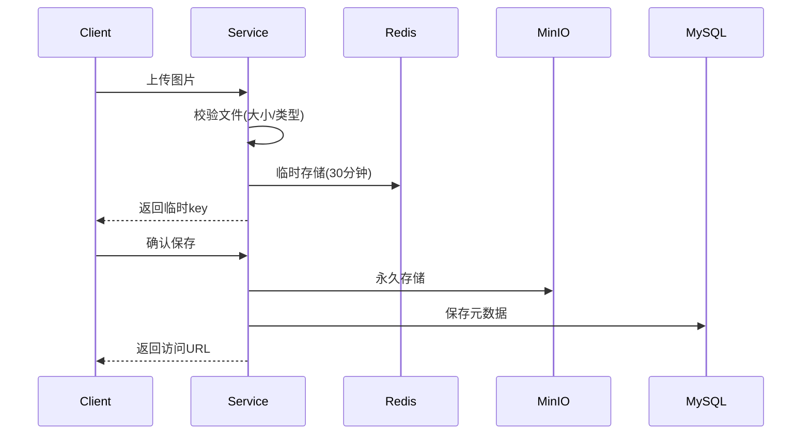
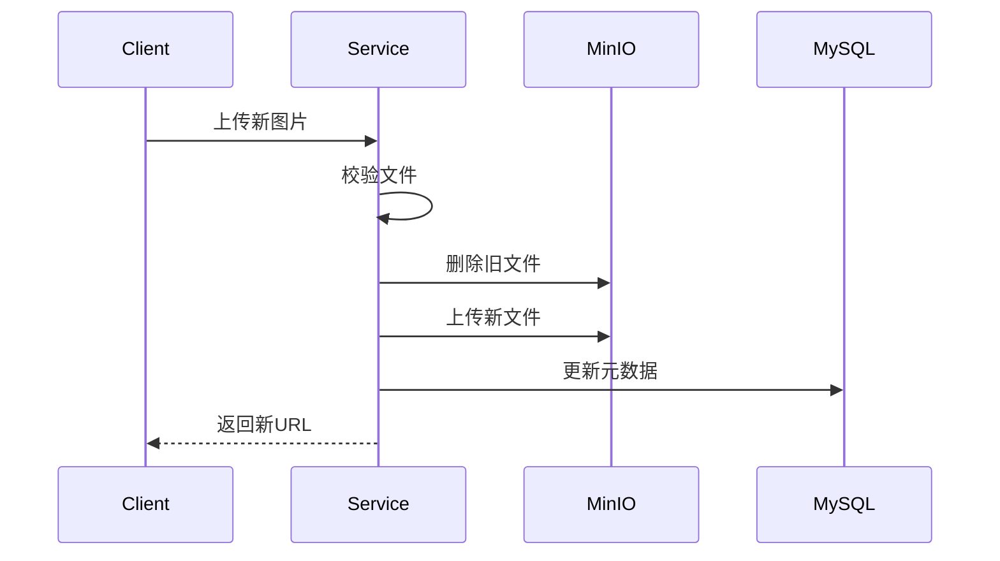
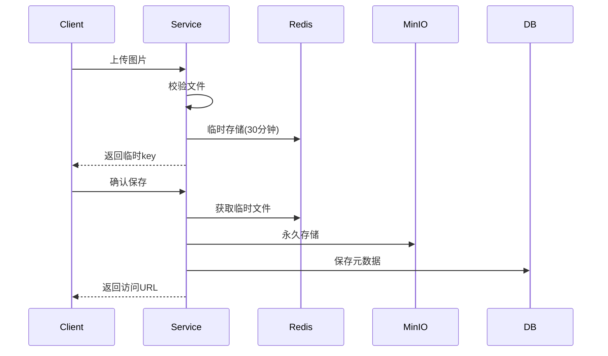
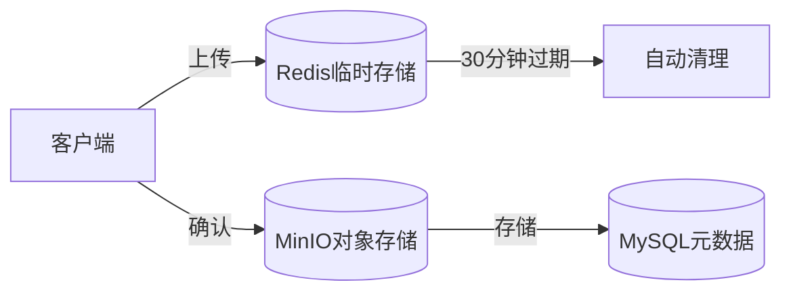
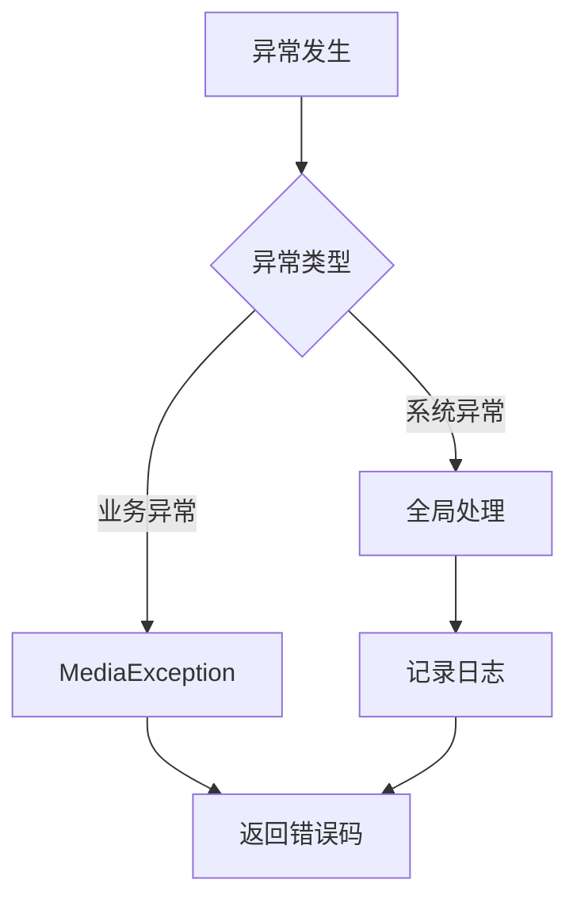

# 媒体服务(Media Service)文档

## 1. 功能概述

### 1.1 已实现功能
- 图片管理
  - 图片上传到临时存储(Redis)
  - 图片临时存储更新
  - 图片永久存储(MinIO)
  - 图片格式校验
  - 图片去重(基于MD5)
  - 图片大小控制(1KB~2MB)
- 文件用途
  - 课程封面
  - 教师头像
  - 其他图片资源
- 文件存储
  - MinIO对象存储集成
  - Redis临时存储
  - 文件元信息管理
- 课程封面管理
  - 封面图片上传
  - 封面图片更新
  - 封面图片删除
  - 图片格式校验
  - 文件去重

### 1.2 待实现功能
- 视频处理
  - 视频上传
  - 视频转码
  - 视频分片上传
- 文件处理
  - 文件预处理
  - 病毒扫描
  - 文件分类
- CDN集成
  - CDN推送
  - 缓存刷新
  - 访问控制

### 1.3 文件校验规则
```yaml
media:
  image:
    max-size: 2097152          # 图片最大2MB
    min-size: 1024             # 图片最小1KB
    allowed-types:             # 允许的图片类型
      - image/jpeg
      - image/jpg
      - image/png
      - image/gif
```

### 1.4 业务流程

1. 图片上传流程


2. 图片更新流程


## 2. 技术架构

### 2.1 核心技术栈
- Spring Boot 3.x：基础框架
- Spring Data JPA：数据访问层
- MinIO：对象存储
- Redis：临时存储
- MySQL：元数据存储
- JUnit 5：单元测试
- Validation：参数校验
- Swagger/OpenAPI：接口文档

### 2.2 项目结构
```
media/
├── controller/          # 控制层
│   └── ImageController.java
├── service/            # 业务层
│   ├── ImageService.java
│   └── impl/
├── repository/         # 数据访问层
│   └── MediaFileRepository.java
├── entity/            # 实体类
│   └── MediaFile.java
├── dto/               # 数据传输对象
│   ├── TempFileDTO.java
│   └── UploadFileDTO.java
├── utils/             # 工具类
│   └── FileTypeUtils.java
└── config/            # 配置类
    ├── MinioConfig.java
    └── RedisConfig.java
```

## 3. 数据模型设计

### 3.1 核心实体
#### MediaFile (媒资文件)
- 主要属性：
  - id: 主键
  - fileId: 文件唯一标识
  - fileName: 文件名
  - filePath: 存储路径
  - fileSize: 文件大小
  - fileType: 文件类型
  - fileMd5: 文件MD5值
  - status: 文件状态
  - url: 访问地址

#### TempFileDTO (临时文件)
- 主要属性：
  - fileName: 文件名
  - contentType: 内容类型
  - fileData: 文件数据
  - fileSize: 文件大小

### 3.2 状态定义
- 文件状态：
  - UPLOADING: 上传中
  - UPLOADED: 已上传
  - FAILED: 上传失败
- 审核状态：
  - PENDING: 待审核
  - APPROVED: 已通过
  - REJECTED: 已拒绝

## 4. API接口设计

### 4.1 图片管理接口
#### 4.1.1 上传图片到临时存储
```http
POST /media/images/temp
Content-Type: multipart/form-data

请求参数：
- file: 图片文件

响应：
{
  "code": 0,
  "message": "success",
  "data": "temp-key-123" // 临时存储key
}
```

#### 4.1.2 保存临时图片到永久存储
```http
POST /media/temp/save
Content-Type: application/json

请求体：
{
  "tempKey": "temp-key-123"
}

响应：
{
  "code": 0,
  "message": "success",
  "data": {
    "mediaFileId": "xxx",
    "fileName": "image.jpg",
    "url": "http://minio/bucket/xxx.jpg"
  }
}
```

#### 4.1.3 删除媒体文件
```http
DELETE /media/files/{url}

响应：
{
  "code": 0,
  "message": "success"
}
```

## 5. 业务实现细节

### 5.1 图片处理流程



1. 文件校验
   ```java
   public class FileTypeUtils {
       private static final List<String> ALLOWED_IMAGE_TYPES = Arrays.asList(
           "image/jpeg", "image/jpg", "image/png", "image/gif"
       );
       
       public static boolean isAllowedImage(MultipartFile file) {
           return ALLOWED_IMAGE_TYPES.contains(file.getContentType());
       }
   }
   ```

2. 文件标识生成
   ```java
   private String generateMediaFileId(Long organizationId, Long courseId, String fileName) {
       String simpleFileName = new File(fileName).getName();
       return String.format("course_%d_%d_%s", 
           organizationId, courseId,
           DigestUtils.md5DigestAsHex(simpleFileName.getBytes())
       );
   }
   ```

### 5.2 存储架构设计



1. 临时存储(Redis)
   - Key格式: media:temp:image:{uuid}
   - 有效期: 30分钟
   - 数据结构: TempFileDTO序列化

2. 永久存储(MinIO)
   - 存储路径: course/logo/{mediaFileId}
   - 文件去重: 基于mediaFileId
   - 访问URL: /{bucketName}/{filePath}

3. 元数据管理(MySQL)
   - 实体类: MediaFile
   - 索引: mediaFileId(唯一索引)
   - 关联关系: 与课程计划多对多

### 5.3 异常处理机制



1. 业务异常
   ```java
   public class MediaException extends RuntimeException {
       private final MediaErrorCode errorCode;
       private final String message;
   }
   ```

2. 全局处理
   ```java
   @RestControllerAdvice
   public class GlobalExceptionHandler {
       @ExceptionHandler(MediaException.class)
       public MediaResponse<Void> handleMediaException(MediaException e) {
           return MediaResponse.error(e.getCode(), e.getMessage());
       }
   }
   ```

### 5.4 文件处理流程

1. 上传流程
   ```mermaid
   sequenceDiagram
       participant Client
       participant Service
       participant MinIO
       participant DB
       
       Client->>Service: 上传文件
       Service->>Service: 校验文件
       Service->>MinIO: 存储文件
       MinIO-->>Service: 返回结果
       Service->>DB: 保存元数据
       Service-->>Client: 返回URL
   ```

2. 删除流程
   ```mermaid
   sequenceDiagram
       participant Client
       participant Service
       participant MinIO
       participant DB
       
       Client->>Service: 删除请求
       Service->>DB: 查询文件
       Service->>MinIO: 删除文件
       Service->>DB: 删除记录
       Service-->>Client: 返回结果
   ```

### 5.5 性能优化

1. 文件缓存策略
   - Redis缓存临时文件
   - MinIO对象缓存
   - 文件URL缓存

2. 数据库优化
   - mediaFileId索引
   - url索引
   - 组合索引优化

3. 并发处理
   - 文件操作原子性
   - 数据一致性保证
   - 重复上传处理

### 5.6 监控指标

1. 业务指标
   - 上传成功率
   - 文件处理时长
   - 存储空间使用率
   - 文件访问频率

2. 系统指标
   - MinIO连接状态
   - Redis连接状态
   - 服务响应时间
   - 错误率统计

### 5.7 安全措施

1. 文件安全
   - 类型校验
   - 大小限制
   - 内容检测
   - 访问控制

2. 存储安全
   - MinIO访问控制
   - Redis访问控制
   - 数据加密存储
   - 备份机制

3. 接口安全
   - 参数校验
   - 权限控制
   - 防盗链措施
   - 访问频率限制

## 6. 测试覆盖

### 6.1 单元测试
- ImageServiceTest
  - 临时存储测试
  - 永久存储测试
  - 图片更新测试
  - 格式校验测试

### 6.2 HTTP接口测试
- image_test.http
  - 完整上传流程测试
  - 更新操作测试
  - 错误处理测试

## 7. 开发规范

### 7.1 代码规范
- 统一的异常处理
- 统一的返回格式
- 参数校验
- 日志记录

### 7.2 文件命名规范
- 临时文件key: media:temp:image:{uuid}
- MinIO对象名: images/{uuid}.{extension}
- 课程封面文件:
  - mediaFileId格式: course_{organizationId}_{courseId}_{fileMd5}
  - MinIO存储路径: course/logo/{mediaFileId}

## 8. 后续优化建议
1. 添加文件预处理机制
2. 实现视频处理功能
3. 集成CDN服务
4. 完善文件安全检查
5. 添加文件分类功能
6. 优化文件存储结构
7. 实现文件分片上传

## 9. 监控告警
1. 文件上传成功率监控
2. 存储空间使用监控
3. Redis键过期监控
4. 接口响应时间监控
5. 异常情况告警

## 10. 安全措施
1. 文件类型校验
2. 文件大小限制
3. 临时文件过期清理
4. 访问权限控制
5. 防盗链措施

## 11. 异常处理

### 11.1 业务异常
- FILE_EMPTY: 文件为空
- FILE_TOO_LARGE: 超过大小限制(2MB)
- FILE_TOO_SMALL: 小于最小限制(1KB)
- MEDIA_TYPE_NOT_SUPPORT: 不支持的文件类型
- FILE_NOT_EXISTS: 文件不存在
- UPLOAD_ERROR: 上传失败

### 11.2 异常处理示例
```java
@RestControllerAdvice
public class GlobalExceptionHandler {
    @ExceptionHandler(MediaException.class)
    public MediaResponse<?> handleMediaException(MediaException e) {
        return MediaResponse.error(e.getCode(), e.getMessage());
    }
}
```

## 12. 测试用例示例
```java
@Test
void testUploadCourseLogo_FileTooLarge() {
    // 准备超大文件
    byte[] largeContent = new byte[3 * 1024 * 1024]; // 3MB
    MockMultipartFile file = new MockMultipartFile(
            "file", "test.jpg", "image/jpeg", largeContent);

    // 验证异常
    MediaException exception = assertThrows(MediaException.class,
            () -> imageService.uploadCourseLogo(1L, 1L, file));
    assertEquals(MediaErrorCode.FILE_TOO_LARGE, exception.getErrorCode());
} 
```

## 6. 错误码说明

#### 6.1 媒体文件相关错误 (2001xx)
| 错误码 | 说明 |
|--------|------|
| 200101 | 文件不存在 |
| 200102 | 不支持的媒体类型 |
| 200103 | 上传失败 |
| 200104 | 删除失败 |
| 200105 | 文件大小超过限制 |
| 200106 | 文件大小过小 |
| 200107 | 文件为空 |
| 200108 | 文件类型错误 |
| 200109 | 文件上传失败 |

#### 6.2 处理相关错误 (2002xx)
| 错误码 | 说明 |
|--------|------|
| 200201 | 文件处理失败 |
| 200202 | 处理状态错误 |

#### 6.3 MinIO相关错误 (2003xx)
| 错误码 | 说明 |
|--------|------|
| 200301 | MinIO连接失败 |
| 200302 | 存储桶操作失败 |
| 200303 | MinIO上传失败 |

#### 6.4 系统错误 (2999xx)
| 错误码 | 说明 |
|--------|------|
| 299901 | 参数错误 |
| 299999 | 系统内部错误 |


媒体文件分片上传完整流程 (文字说明):
客户端发起 "初始化分片上传" 请求 (Initiate Multipart Upload Request):
客户端 (例如浏览器或 App) 向后端 API /api/media/upload/initiate 发送 POST 请求。
请求体中包含文件元数据信息，例如：fileName (文件名), fileSize (文件大小), mediaType (媒体类型), mimeType (MIME 类型), purpose (文件用途), organizationId (机构 ID) 等。
服务端处理 "初始化分片上传" 请求 (Initiate Multipart Upload):
MediaUploadController 接收到请求，并调用 MediaUploadService.initiateMultipartUpload() 方法。
MediaUploadServiceImpl.initiateMultipartUpload() 方法执行以下操作：
生成唯一的 uploadId (分片上传 ID) 和 mediaFileId (媒体文件 ID)。
确定文件在 MinIO 存储桶中的存储路径 (bucket 和 filePath)。
计算分片大小 (chunkSize) 和总分片数 (totalChunks)。
创建 MultipartUploadRecord 实体对象，记录分片上传会话信息，并将状态设置为 "UPLOADING"。
将 MultipartUploadRecord 实体对象保存到数据库。
构建 InitiateMultipartUploadResponseDTO 响应对象，包含 uploadId, mediaFileId, bucket, filePath, chunkSize, totalChunks 等信息。
MediaUploadController 将 InitiateMultipartUploadResponseDTO 封装在 CommonResponse 中，并返回给客户端。
客户端接收 "初始化分片上传" 响应 (Initiate Multipart Upload Response):
客户端接收到 /api/media/upload/initiate 接口的响应，从中获取 uploadId, chunkSize 等关键信息，并保存起来，用于后续的分片上传操作。
客户端分片上传文件 (Upload Chunks):
客户端将要上传的文件按照 chunkSize 分割成多个分片 (chunk)。
循环上传每个分片: 对于每个分片，客户端执行以下操作：
获取 "分片预签名 URL" (Get Presigned URL for Upload Chunk): 客户端向后端 API /api/media/upload/presigned-url 发送 GET 请求，请求参数包含 uploadId (分片上传 ID) 和 chunkIndex (分片索引，从 1 开始)。 服务端会验证 uploadId 的有效性，并为当前分片生成一个带有上传权限的预签名 URL (Presigned PUT URL)，并返回给客户端。 （这是我们下一步要开发的 API 接口）
使用预签名 URL 上传分片 (Upload Chunk to MinIO): 客户端使用上一步获取的预签名 URL，向 MinIO 对象存储服务发送 PUT 请求，将当前分片的数据作为请求体上传到 MinIO。 客户端直接与 MinIO 服务交互，无需经过后端服务。
后端服务更新已上传分片记录 (Update Uploaded Chunks): （可选步骤，可以优化上传进度展示） 客户端可以异步地向后端 API 发送请求，告知服务端某个分片已经上传完成。 服务端可以更新 MultipartUploadRecord 记录中的 uploadedChunks 字段，用于跟踪上传进度。
客户端发起 "完成分片上传" 请求 (Complete Multipart Upload Request):
当所有分片都上传完成后，客户端向后端 API /api/media/upload/complete 发送 POST 请求。
请求体中包含 uploadId (分片上传 ID)。
服务端处理 "完成分片上传" 请求 (Complete Multipart Upload):
MediaUploadController 接收到请求，并调用 MediaUploadService.completeMultipartUpload() 方法。
MediaUploadServiceImpl.completeMultipartUpload() 方法执行以下操作：
根据 uploadId 从数据库中查询 MultipartUploadRecord 记录。
合并 MinIO 中的所有分片文件，生成最终的完整文件。 （MinIO 服务端合并分片）
验证文件完整性 (可选，例如校验 MD5 或 SHA-256)。
更新 MultipartUploadRecord 记录的状态为 "COMPLETED"，并记录完成时间。
创建 MediaFile 实体对象，记录最终上传完成的媒体文件信息 (例如文件名, 文件大小, 存储路径, 媒体类型, MIME 类型, 用途等)，并保存到数据库。
构建 CompleteMultipartUploadResponseDTO 响应对象，包含最终的 mediaFileId 和文件访问 URL 等信息。
MediaUploadController 将 CompleteMultipartUploadResponseDTO 封装在 CommonResponse 中，并返回给客户端。
客户端接收 "完成分片上传" 响应 (Complete Multipart Upload Response):
客户端接收到 /api/media/upload/complete 接口的响应，从中获取最终的 mediaFileId 和文件访问 URL 等信息。
客户端可以使用文件访问 URL 下载或播放已上传的媒体文件。


需要开发的内容详细描述:
1. 客户端 (Client-side Development):
核心上传功能:
初始化上传请求: 实现调用后端 /initiate-upload API 的功能，发送文件名、文件大小等信息，并接收后端返回的 uploadId、chunkSize 等信息。
获取预签名 URL 请求: 实现循环调用后端 /presigned-url API 的功能，根据 uploadId 和 chunkIndex 获取每个分片的预签名 URL。
分片上传逻辑: 实现使用 fetch API 或选定的上传库，根据预签名 URL 将文件分片上传到 MinIO 的逻辑。需要处理文件分片、循环上传、请求头设置等细节。
完成上传请求: 在所有分片上传完成后，实现调用后端 /complete-upload API 的功能，发送 uploadId 通知后端合并分片。
上传进度显示: 在用户界面上显示上传进度条和上传百分比，实时反馈上传状态。
用户交互和体验:
文件选择: 提供文件选择控件 (例如 <input type="file">)，允许用户选择要上传的视频文件。
上传状态展示: 清晰地展示上传状态，包括 "准备上传"、"上传中"、"上传完成"、"上传失败" 等状态。
错误提示: 当上传过程中发生错误时 (例如网络错误、服务器错误)，向用户显示友好的错误提示信息。
可选功能 (后续迭代):
断点续传: 实现断点续传功能，允许用户在网络中断或关闭浏览器后，下次继续上传未完成的文件。
暂停/取消上传: 提供暂停和取消上传的功能。

```mermaid
sequence
sequenceDiagram
participant Client
participant Backend Service
participant MinIO
participant DB
Client->>Backend Service: 1. 初始化分片上传 (fileName, fileSize, mimeType, purpose, organizationId, fileSha256Hex)
Backend Service->>Backend Service: 生成 Upload ID, 预签名 URL 策略
Backend Service->>DB: 创建 MultipartUploadRecord (INITIATED)
Backend Service-->>Client: 返回 Upload ID, 预签名 URL 策略
loop 分片上传
Client->>Backend Service: 请求分片预签名 URL (Upload ID, 分片序号)
Backend Service->>MinIO: 生成分片预签名 URL (Upload ID, 分片序号)
Backend Service-->>Client: 返回分片预签名 URL
Client->>MinIO: 2. 上传分片数据 (PUT 预签名 URL)
MinIO-->>Client: 返回 OK
Client->>Backend Service: 更新分片上传进度 (Upload ID, uploadedChunks)
Backend Service->>DB: 更新 MultipartUploadRecord (uploadedChunks)
end
Client->>Backend Service: 3. 完成分片上传 (Upload ID)
Backend Service->>DB: 查询 MultipartUploadRecord (Upload ID)
Backend Service->>MinIO: 请求合并分片 (Upload ID)
MinIO->>MinIO: 服务端合并分片
MinIO-->>Backend Service: 返回 OK
Backend Service->>Backend Service: 文件大小校验, SHA-256 校验
alt 校验成功
Backend Service->>DB: 更新 MultipartUploadRecord (COMPLETED), 创建 MediaFile, MediaProcessHistory 记录
Backend Service->>Message Queue: 发送 异步元信息提取任务
Backend Service-->>Client: 4. 上传成功响应
else 校验失败
Backend Service->>Backend Service: 清理已上传分片和合并文件
Backend Service->>DB: 更新 MultipartUploadRecord (FAILED)
Backend Service-->>Client: 4. 上传失败响应 (Error)
end
Message Queue-->>Backend Service: 异步元信息提取任务
Backend Service->>MinIO: 读取完整视频文件
Backend Service->>Backend Service: 提取元信息, 转码等处理
Backend Service->>DB: 更新 MediaFile, MediaProcessHistory 记录
```

**流程图更新说明:**

*   **步骤 1 "初始化分片上传"**:  在请求参数中增加了 `fileSha256Hex`，表示客户端会在初始化上传时提供文件的 SHA-256 哈希值。
*   **循环 "分片上传"**:  在每次分片上传后，客户端会向后端发送 "更新分片上传进度" 请求，后端会更新 `MultipartUploadRecord` 中的 `uploadedChunks` 字段。
*   **步骤 3 "完成分片上传"**:
    *   后端在合并分片后，增加了 "**文件大小校验, SHA-256 校验**" 步骤。
    *   增加了一个 `alt 校验成功/校验失败` 分支，明确表示了校验成功和失败两种情况下的后续流程：
        *   **校验成功**:  继续创建 `MediaFile` 记录，发送消息队列任务，并返回上传成功响应。
        *   **校验失败**:  清理已上传的文件，更新 `MultipartUploadRecord` 状态为 `FAILED`，并返回上传失败响应。

**第一步完成后的测试:**

*   **视觉检查:**  打开 `docs/media.md` 文件，查看流程图是否已经更新，新的步骤和分支是否清晰地显示出来。
*   **理解验证:**  仔细阅读更新后的流程图，确认新的流程是否准确地反映了包含 SHA-256 校验的文件上传流程。

**完成第一步后，请告诉我，我们就可以开始进行第二步，修改 `MultipartUploadRecord.java` 实体类了。**

I. 总体开发计划

该计划首先专注于构建一个最小可行产品（MVP），强调核心功能和微服务原则。然后概述了后续阶段的增强和优化。

A. MVP 阶段（重点：功能性转码流水线）

目标： 创建一个可工作的转码流水线，能够处理视频上传，将它们分片成基于时间的片段，使用 FFmpeg 转码这些片段，并存储结果。确保基本的容错性和幂等性。

关键特性：

视频上传处理（基本 - 对于 MVP，可以只是手动上传到 MinIO）。

使用 FFmpeg 进行基于时间的分片。

使用 Spring Cloud Stream 进行消息队列（RabbitMQ 或 Kafka 绑定器）。

转码服务消费消息并使用 FFmpeg。

本地消息表（transcoding_tasks）用于事务性和幂等性。

基本错误处理（使用 Spring Retry 进行重试）。

在 MinIO 中存储原始和转码后的视频块。

基本日志记录。

健康检查（Spring Boot Actuator）。

技术栈：

Java（使用 Spring Boot）

Spring Cloud（Stream、Config，可能还有 Gateway 和 Service Discovery）

MinIO（使用 Java 客户端）

FFmpeg

数据库（PostgreSQL、MySQL 或类似数据库）

消息代理（RabbitMQ 或 Kafka - 通过 Spring Cloud Stream 绑定器选择）

B. 第 2 阶段（增强和可扩展性）

目标： 提高性能、可扩展性和弹性。添加更复杂的功能。

关键特性：

单独的上传服务： 将视频上传和元数据提取与转码服务解耦。

消息发布服务（可选）： 用于处理从本地消息表发布消息的专用服务。

优化的 FFmpeg 配置： 微调 FFmpeg 参数以获得速度、质量和文件大小。

高级分片（可选）： 探索基于场景或关键帧的分片。

死信队列（DLQ）处理： 实现对重试后失败的消息的正确处理。

全面监控： 与 Prometheus 和 Grafana 集成，以获得详细的指标和警报。

改进的日志记录： 增强日志记录以进行更好的诊断和故障排除。

水平扩展： 测试和优化以运行转码服务的多个实例。

API 网关： 实现 API 网关以获得统一的入口点。

C. 第 3 阶段（高级特性和优化）

目标： 添加高级特性，进一步优化性能，并探索新功能。

关键特性：

支持多种输出格式： 转码为不同的分辨率、编解码器和容器。

自适应比特率流（ABS）： 生成 HLS 或 DASH 清单以进行自适应流式传输。

水印： 向转码后的视频添加水印。

缩略图生成： 从视频创建缩略图。

内容分发网络（CDN）集成： 与 CDN 集成以实现更快的视频交付。

高级错误分析： 实现更复杂的错误分析和报告。

自动化测试： 开发一套全面的自动化测试（单元测试、集成测试、性能测试）。

II. 开发流程（逐步）

这概述了 MVP 的推荐开发步骤顺序：

项目设置和依赖项：

创建一个新的 Spring Boot 项目。

添加 Spring Cloud Stream、MinIO 客户端、数据库驱动程序、Spring Retry、Spring Boot Actuator、Lombok（可选，但推荐）和测试框架（JUnit、Mockito）的依赖项。

配置基本项目设置（应用程序名称、端口等）。

数据库模式：

在您选择的数据库中设计并创建 transcoding_tasks 表。包括 video_id、chunk_id、status、message_id、created_at、updated_at、retry_count、input_path、output_path 和 transcoding_parameters 等列。

MinIO 设置：

设置 MinIO 实例（本地或云端）。

创建用于存储原始和转码视频的存储桶。

在您的应用程序属性中配置 MinIO 凭据（或使用 Spring Cloud Config）。

FFmpeg 安装：

确保在您的开发和部署环境中安装并可访问 FFmpeg。

消息代理设置：

设置 RabbitMQ 或 Kafka 实例（本地或云端）。

配置 Spring Cloud Stream 绑定器以连接到您选择的消息代理。

核心转码服务（消费者）：

创建一个 Spring Cloud Stream 消费者（使用 @StreamListener）。

定义您的转码任务的消息负载（POJO）。

实现核心转码逻辑：

接收消息。

查询 transcoding_tasks 表（检查幂等性，处理现有记录）。

如果需要，插入/更新 transcoding_tasks 表（使用 @Transactional 和条件更新）。

构建 FFmpeg 命令（使用来自消息和元数据的信息）。

执行 FFmpeg 命令（使用 ProcessBuilder 或类似工具）。

处理 FFmpeg 输出和退出代码。

将转码后的块存储在 MinIO 中。

更新 transcoding_tasks 表（为 COMPLETED 或 FAILED）。

确认消息。

对转码失败实施 Spring Retry 进行重试。

使用线程池（ExecutorService）来处理多个任务。

消息发布者（生产者 - 用于测试）：

对于 MVP，您可以最初将消息发布逻辑组合到转码服务本身中（使用调度任务 - @Scheduled）。稍后，您可以将其分离到一个专用服务中。

发布者（或调度任务）应：

定期查询 transcoding_tasks 表中 status = 'PENDING' 的记录。

对于每个待处理记录，构建并向队列发送消息（使用 Spring Cloud Stream）。

发布后更新状态。

基本分片（基于时间）：

创建一个实用程序类或方法，该类或方法使用 FFmpeg：

获取视频元数据（持续时间）。

根据所需的段长度计算块的开始/结束时间。

生成 FFmpeg 命令以提取这些块（使用 -ss 和 -to 选项）。

“上传器”（为 MVP 简化）：

对于初始测试，您可以手动：

将测试视频上传到 MinIO。

使用您的分片实用程序在本地创建块。

手动将记录插入到 transcoding_tasks 表中，其中包含适当的信息（路径、块 ID 等）。

将第一个块的消息发送到 MQ 以开始。

测试：

为您的分片逻辑和 FFmpeg 命令生成编写单元测试。

为您的 Spring Cloud Stream 消费者编写集成测试（您可以使用嵌入式消息代理进行测试）。

使用示例视频手动端到端测试整个流水线。

健康检查：

配置 Spring Boot Actuator 以公开健康端点。

验证您的数据库、MinIO 连接和消息代理连接的健康状况。

日志记录：

为关键步骤和错误处理添加适当的日志记录语句。

部署：

将您的应用程序打包为 JAR 或 Docker 镜像。

部署到您选择的环境（本地机器、云等）。

III. 关键原则和提醒

迭代开发： 以小的、增量的步骤进行构建和测试。不要试图一次实现所有功能。

微服务原则： 保持您的服务专注、独立和可部署。

最终一致性： 理解并接受最终一致性。本地消息表确保转码最终会发生，即使存在临时故障。

幂等性： 始终将您的消息消费者设计为幂等的。

监控和警报： 尽早设置监控和警报以快速检测问题。

配置管理： 使用 Spring Cloud Config 进行外部化配置。

尽早并经常测试：