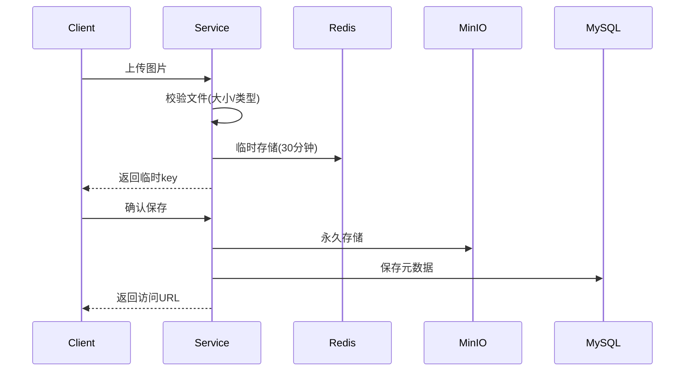
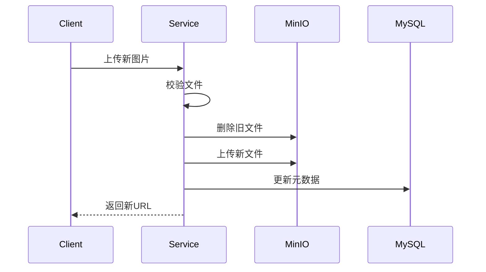
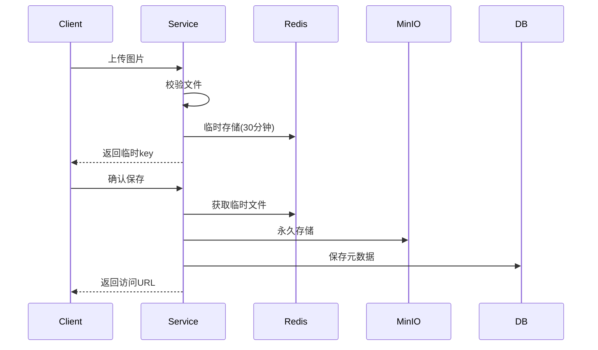
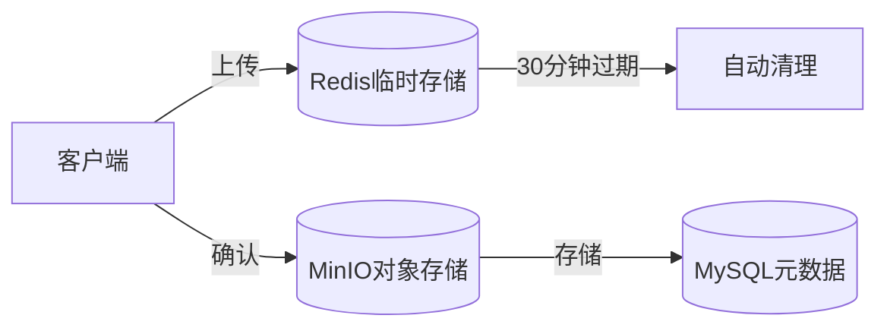
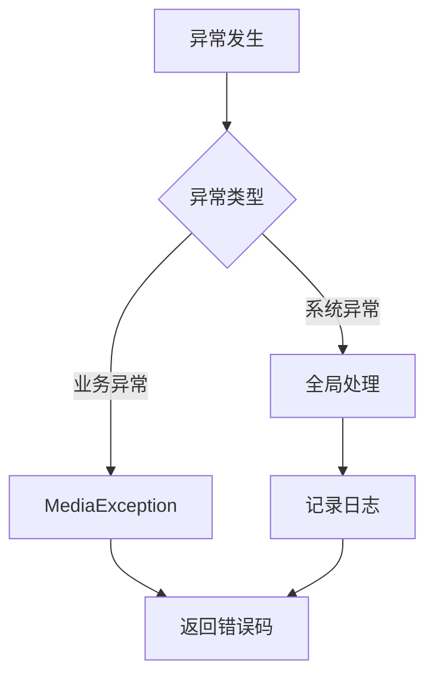

# 媒体服务(Media Service)文档

## 1. 功能概述

### 1.1 已实现功能
- 图片管理
  - 图片上传到临时存储(Redis)
  - 图片临时存储更新
  - 图片永久存储(MinIO)
  - 图片格式校验
  - 图片去重(基于MD5)
  - 图片大小控制(1KB~2MB)
- 文件用途
  - 课程封面
  - 教师头像
  - 其他图片资源
- 文件存储
  - MinIO对象存储集成
  - Redis临时存储
  - 文件元信息管理
- 课程封面管理
  - 封面图片上传
  - 封面图片更新
  - 封面图片删除
  - 图片格式校验
  - 文件去重

### 1.2 待实现功能
- 视频处理
  - 视频上传
  - 视频转码
  - 视频分片上传
- 文件处理
  - 文件预处理
  - 病毒扫描
  - 文件分类
- CDN集成
  - CDN推送
  - 缓存刷新
  - 访问控制

### 1.3 文件校验规则
```yaml
media:
  image:
    max-size: 2097152          # 图片最大2MB
    min-size: 1024             # 图片最小1KB
    allowed-types:             # 允许的图片类型
      - image/jpeg
      - image/jpg
      - image/png
      - image/gif
```

### 1.4 业务流程

1. 图片上传流程


2. 图片更新流程


## 2. 技术架构

### 2.1 核心技术栈
- Spring Boot 3.x：基础框架
- Spring Data JPA：数据访问层
- MinIO：对象存储
- Redis：临时存储
- MySQL：元数据存储
- JUnit 5：单元测试
- Validation：参数校验
- Swagger/OpenAPI：接口文档

### 2.2 项目结构
```
media/
├── controller/          # 控制层
│   └── ImageController.java
├── service/            # 业务层
│   ├── ImageService.java
│   └── impl/
├── repository/         # 数据访问层
│   └── MediaFileRepository.java
├── entity/            # 实体类
│   └── MediaFile.java
├── dto/               # 数据传输对象
│   ├── TempFileDTO.java
│   └── UploadFileDTO.java
├── utils/             # 工具类
│   └── FileTypeUtils.java
└── config/            # 配置类
    ├── MinioConfig.java
    └── RedisConfig.java
```

## 3. 数据模型设计

### 3.1 核心实体
#### MediaFile (媒资文件)
- 主要属性：
  - id: 主键
  - fileId: 文件唯一标识
  - fileName: 文件名
  - filePath: 存储路径
  - fileSize: 文件大小
  - fileType: 文件类型
  - fileMd5: 文件MD5值
  - status: 文件状态
  - url: 访问地址

#### TempFileDTO (临时文件)
- 主要属性：
  - fileName: 文件名
  - contentType: 内容类型
  - fileData: 文件数据
  - fileSize: 文件大小

### 3.2 状态定义
- 文件状态：
  - UPLOADING: 上传中
  - UPLOADED: 已上传
  - FAILED: 上传失败
- 审核状态：
  - PENDING: 待审核
  - APPROVED: 已通过
  - REJECTED: 已拒绝

## 4. API接口设计

### 4.1 图片管理接口
#### 4.1.1 上传图片到临时存储
```http
POST /media/images/temp
Content-Type: multipart/form-data

请求参数：
- file: 图片文件

响应：
{
  "code": 0,
  "message": "success",
  "data": "temp-key-123" // 临时存储key
}
```

#### 4.1.2 保存临时图片到永久存储
```http
POST /media/temp/save
Content-Type: application/json

请求体：
{
  "tempKey": "temp-key-123"
}

响应：
{
  "code": 0,
  "message": "success",
  "data": {
    "mediaFileId": "xxx",
    "fileName": "image.jpg",
    "url": "http://minio/bucket/xxx.jpg"
  }
}
```

#### 4.1.3 删除媒体文件
```http
DELETE /media/files/{url}

响应：
{
  "code": 0,
  "message": "success"
}
```

## 5. 业务实现细节

### 5.1 图片处理流程



1. 文件校验
   ```java
   public class FileTypeUtils {
       private static final List<String> ALLOWED_IMAGE_TYPES = Arrays.asList(
           "image/jpeg", "image/jpg", "image/png", "image/gif"
       );
       
       public static boolean isAllowedImage(MultipartFile file) {
           return ALLOWED_IMAGE_TYPES.contains(file.getContentType());
       }
   }
   ```

2. 文件标识生成
   ```java
   private String generateMediaFileId(Long organizationId, Long courseId, String fileName) {
       String simpleFileName = new File(fileName).getName();
       return String.format("course_%d_%d_%s", 
           organizationId, courseId,
           DigestUtils.md5DigestAsHex(simpleFileName.getBytes())
       );
   }
   ```

### 5.2 存储架构设计



1. 临时存储(Redis)
   - Key格式: media:temp:image:{uuid}
   - 有效期: 30分钟
   - 数据结构: TempFileDTO序列化

2. 永久存储(MinIO)
   - 存储路径: course/logo/{mediaFileId}
   - 文件去重: 基于mediaFileId
   - 访问URL: /{bucketName}/{filePath}

3. 元数据管理(MySQL)
   - 实体类: MediaFile
   - 索引: mediaFileId(唯一索引)
   - 关联关系: 与课程计划多对多

### 5.3 异常处理机制



1. 业务异常
   ```java
   public class MediaException extends RuntimeException {
       private final MediaErrorCode errorCode;
       private final String message;
   }
   ```

2. 全局处理
   ```java
   @RestControllerAdvice
   public class GlobalExceptionHandler {
       @ExceptionHandler(MediaException.class)
       public MediaResponse<Void> handleMediaException(MediaException e) {
           return MediaResponse.error(e.getCode(), e.getMessage());
       }
   }
   ```

### 5.4 文件处理流程

1. 上传流程
   ```mermaid
   sequenceDiagram
       participant Client
       participant Service
       participant MinIO
       participant DB
       
       Client->>Service: 上传文件
       Service->>Service: 校验文件
       Service->>MinIO: 存储文件
       MinIO-->>Service: 返回结果
       Service->>DB: 保存元数据
       Service-->>Client: 返回URL
   ```

2. 删除流程
   ```mermaid
   sequenceDiagram
       participant Client
       participant Service
       participant MinIO
       participant DB
       
       Client->>Service: 删除请求
       Service->>DB: 查询文件
       Service->>MinIO: 删除文件
       Service->>DB: 删除记录
       Service-->>Client: 返回结果
   ```

### 5.5 性能优化

1. 文件缓存策略
   - Redis缓存临时文件
   - MinIO对象缓存
   - 文件URL缓存

2. 数据库优化
   - mediaFileId索引
   - url索引
   - 组合索引优化

3. 并发处理
   - 文件操作原子性
   - 数据一致性保证
   - 重复上传处理

### 5.6 监控指标

1. 业务指标
   - 上传成功率
   - 文件处理时长
   - 存储空间使用率
   - 文件访问频率

2. 系统指标
   - MinIO连接状态
   - Redis连接状态
   - 服务响应时间
   - 错误率统计

### 5.7 安全措施

1. 文件安全
   - 类型校验
   - 大小限制
   - 内容检测
   - 访问控制

2. 存储安全
   - MinIO访问控制
   - Redis访问控制
   - 数据加密存储
   - 备份机制

3. 接口安全
   - 参数校验
   - 权限控制
   - 防盗链措施
   - 访问频率限制

## 6. 测试覆盖

### 6.1 单元测试
- ImageServiceTest
  - 临时存储测试
  - 永久存储测试
  - 图片更新测试
  - 格式校验测试

### 6.2 HTTP接口测试
- image_test.http
  - 完整上传流程测试
  - 更新操作测试
  - 错误处理测试

## 7. 开发规范

### 7.1 代码规范
- 统一的异常处理
- 统一的返回格式
- 参数校验
- 日志记录

### 7.2 文件命名规范
- 临时文件key: media:temp:image:{uuid}
- MinIO对象名: images/{uuid}.{extension}
- 课程封面文件:
  - mediaFileId格式: course_{organizationId}_{courseId}_{fileMd5}
  - MinIO存储路径: course/logo/{mediaFileId}

## 8. 后续优化建议
1. 添加文件预处理机制
2. 实现视频处理功能
3. 集成CDN服务
4. 完善文件安全检查
5. 添加文件分类功能
6. 优化文件存储结构
7. 实现文件分片上传

## 9. 监控告警
1. 文件上传成功率监控
2. 存储空间使用监控
3. Redis键过期监控
4. 接口响应时间监控
5. 异常情况告警

## 10. 安全措施
1. 文件类型校验
2. 文件大小限制
3. 临时文件过期清理
4. 访问权限控制
5. 防盗链措施

## 11. 异常处理

### 11.1 业务异常
- FILE_EMPTY: 文件为空
- FILE_TOO_LARGE: 超过大小限制(2MB)
- FILE_TOO_SMALL: 小于最小限制(1KB)
- MEDIA_TYPE_NOT_SUPPORT: 不支持的文件类型
- FILE_NOT_EXISTS: 文件不存在
- UPLOAD_ERROR: 上传失败

### 11.2 异常处理示例
```java
@RestControllerAdvice
public class GlobalExceptionHandler {
    @ExceptionHandler(MediaException.class)
    public MediaResponse<?> handleMediaException(MediaException e) {
        return MediaResponse.error(e.getCode(), e.getMessage());
    }
}
```

## 12. 测试用例示例
```java
@Test
void testUploadCourseLogo_FileTooLarge() {
    // 准备超大文件
    byte[] largeContent = new byte[3 * 1024 * 1024]; // 3MB
    MockMultipartFile file = new MockMultipartFile(
            "file", "test.jpg", "image/jpeg", largeContent);

    // 验证异常
    MediaException exception = assertThrows(MediaException.class,
            () -> imageService.uploadCourseLogo(1L, 1L, file));
    assertEquals(MediaErrorCode.FILE_TOO_LARGE, exception.getErrorCode());
} 
```

## 6. 错误码说明

#### 6.1 媒体文件相关错误 (2001xx)
| 错误码 | 说明 |
|--------|------|
| 200101 | 文件不存在 |
| 200102 | 不支持的媒体类型 |
| 200103 | 上传失败 |
| 200104 | 删除失败 |
| 200105 | 文件大小超过限制 |
| 200106 | 文件大小过小 |
| 200107 | 文件为空 |
| 200108 | 文件类型错误 |
| 200109 | 文件上传失败 |

#### 6.2 处理相关错误 (2002xx)
| 错误码 | 说明 |
|--------|------|
| 200201 | 文件处理失败 |
| 200202 | 处理状态错误 |

#### 6.3 MinIO相关错误 (2003xx)
| 错误码 | 说明 |
|--------|------|
| 200301 | MinIO连接失败 |
| 200302 | 存储桶操作失败 |
| 200303 | MinIO上传失败 |

#### 6.4 系统错误 (2999xx)
| 错误码 | 说明 |
|--------|------|
| 299901 | 参数错误 |
| 299999 | 系统内部错误 |