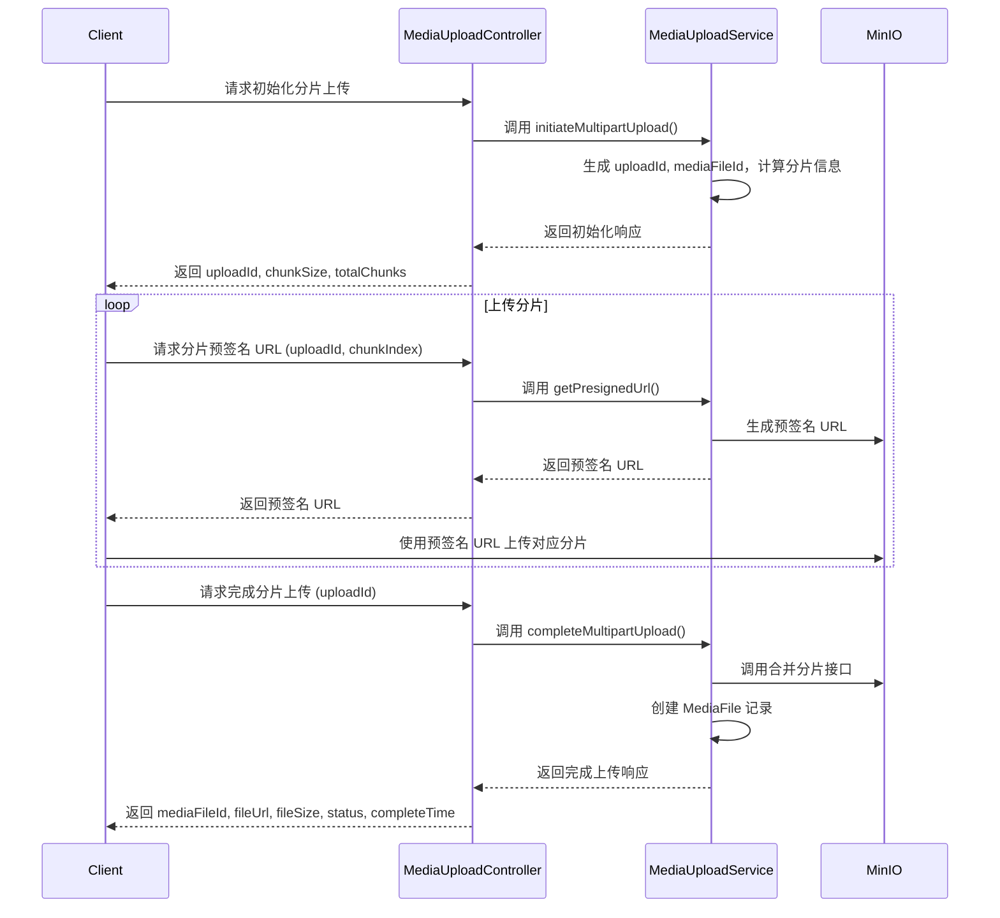
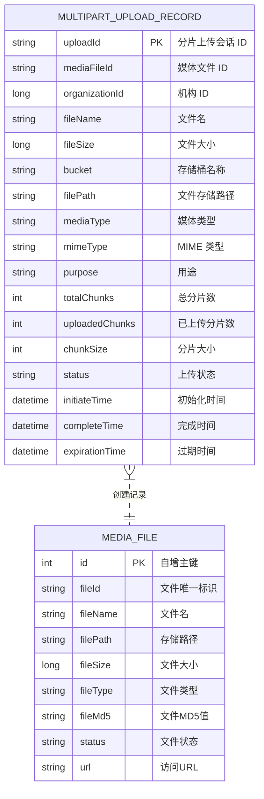

# 媒体服务(Media Service)文档

## 1. 概述 (Overview)

### 1.1 项目背景 (Project Background)
本项目致力于为各类业务场景提供媒体文件管理服务，支持图片及视频的上传、存储和处理。系统目前实现了图片的临时及永久存储，并计划逐步扩展视频上传、转码和分片上传等功能。

### 1.2 功能简介 (Feature Overview)
- **已实现功能：**
  - **图片管理：**
    - 图片上传到临时存储（Redis）
    - 图片临时存储更新
    - 图片永久存储（MinIO）
    - 图片格式校验、去重（基于 MD5）以及大小控制（1KB~2MB）
  - **文件用途：**
    - 课程封面、教师头像、其他图片资源
  - **文件存储：**
    - MinIO 对象存储集成、Redis 临时存储、文件元信息管理
  - **课程封面管理：**
    - 上传、更新、删除封面图片；包括格式校验和文件去重

- **待实现功能：**
  - **视频处理：**
    - 视频上传、转码、分片上传
  - **文件处理：**
    - 文件预处理、病毒扫描、文件分类
  - **CDN 集成：**
    - CDN 推送、缓存刷新、访问控制

### 1.3 术语定义 (Glossary)
- **Multipart Upload**：分片上传，把大文件拆分为多个分片进行上传的过程。  
- **Pre-signed URL**：预签名 URL，临时授权客户端直接上传文件到对象存储。  
- **MediaFile**：记录媒体文件信息的实体类，包括文件名、存储路径、文件大小等。

---

## 2. 架构设计 (Architecture Design)

### 2.1 系统架构图 (System Architecture Diagram)
```mermaid
graph TD
    A[客户端 (Mobile/Web/App)] --> B[API网关/Controller]
    B --> C[MediaUploadService]
    C --> D[MinIO对象存储]
    C --> E[MySQL数据库]
    C --> F[Redis缓存]
    C --> G[消息队列 (可选)]
```

### 2.2 模块划分 (Module Division)
- 控制层 (Controller)
- 业务层 (Service)
- 数据访问层 (Repository)
- 实体类 (Entity)
- 数据传输对象 (DTO)
- 工具类 (Utils)
- 配置类 (Config)

### 2.3 核心流程 (Core Processes)

#### 2.3.1 分片上传流程 (Multipart Upload Process)
1. **初始化分片上传：**
   - 客户端向 `/api/media/upload/initiate` 提交文件元数据信息（包括文件名、大小、媒体类型、MIME 类型、用途及机构ID）。
   - 服务端生成唯一的 `uploadId` 和 `mediaFileId`，计算分片大小（chunkSize）和总分片数（totalChunks），创建并保存 `MultipartUploadRecord` 上传记录。
   - 返回初始化响应，包含 `uploadId`、`chunkSize`、`totalChunks` 等关键数据。

2. **上传各个文件分片：**
   - 客户端循环请求 `/api/media/upload/presigned-url`，传递 `uploadId` 与当前分片索引（chunkIndex），服务端生成预签名 URL 返回给客户端。
   - 客户端使用获取到的预签名 URL 直接将对应分片数据上传至 MinIO 对象存储。

3. **完成分片上传：**
   - 客户端调用 `/api/media/upload/complete` 接口，传入 `uploadId`，服务端验证每个分片是否已上传完成，并调用 MinIO 合并所有分片（例如使用 composeObject API）。
   - 合并后获得完整文件的信息，更新 `MultipartUploadRecord` 的状态（标记为 COMPLETED）、记录完成时间，并依据相关信息创建 `MediaFile` 记录。
   - 最终返回包含 `mediaFileId`、`fileUrl`、`fileSize`、`status`、`completeTime` 等字段的响应。

下面是该分片上传过程的时序图示意：



#### 2.3.2 其他流程 (Additional Processes)
其他流程（如图片上传和更新流程）参照原有时序图，具体流程描述保持不变。

---

## 3. API 接口设计 (API Design)

### 3.1 接口列表 (API List)
- **POST /media/images/temp**  
  上传图片到临时存储
- **POST /media/temp/save**  
  保存临时图片到永久存储
- **DELETE /media/files/{url}**  
  删除媒体文件
- **POST /api/media/upload/initiate**  
  初始化分片上传
- **GET /api/media/upload/presigned-url**  
  获取分片上传预签名 URL
- **POST /api/media/upload/complete**  
  完成分片上传
- ...（其他接口）

### 3.2 接口详情 (API Details)

#### 3.2.1 初始化分片上传 (/api/media/upload/initiate)
**请求参数：**
- fileName: 文件名 (必填)
- fileSize: 文件大小 (必填)
- mediaType: 媒体类型（例如 IMAGE、VIDEO） (必填)
- mimeType: MIME 类型 (必填)
- purpose: 文件用途（例如课程封面） (必填)
- organizationId: 机构 ID (必填)

**响应参数：**
- uploadId: 分片上传会话 ID
- mediaFileId: 媒体文件 ID
- bucket: 存储桶名称
- filePath: 存储路径
- chunkSize: 分片大小（字节）
- totalChunks: 总分片数

**请求示例：**
```json
POST /api/media/upload/initiate
Content-Type: application/json

{
  "fileName": "example.jpg",
  "fileSize": 2048000,
  "mediaType": "IMAGE",
  "mimeType": "image/jpeg",
  "purpose": "COURSE_COVER",
  "organizationId": 1
}
```

**成功响应示例：**
```json
{
  "code": 0,
  "message": "success",
  "data": {
    "uploadId": "abc123",
    "mediaFileId": "org_1_abc123",
    "bucket": "default-bucket",
    "filePath": "images/org_1_abc123.jpg",
    "chunkSize": 524288,
    "totalChunks": 4
  }
}
```

---

#### 3.2.2 获取分片上传预签名 URL (/api/media/upload/presigned-url)
**请求参数：**
- uploadId: 分片上传会话 ID (必填)
- chunkIndex: 当前分片索引，从 1 开始 (必填)

**响应参数：**
- presignedUrl: 预签名上传 URL
- expirationTime: URL 有效截止时间（时间戳）

**请求示例：**
```
GET /api/media/upload/presigned-url?uploadId=abc123&chunkIndex=1
```

**成功响应示例：**
```json
{
  "code": 0,
  "message": "success",
  "data": {
    "presignedUrl": "https://minio.example.com/...",
    "expirationTime": 1677600000000
  }
}
```

---

#### 3.2.3 完成分片上传 (/api/media/upload/complete)
**请求参数：**
- uploadId: 分片上传会话 ID (必填)

**响应参数：**
- mediaFileId: 媒体文件 ID
- fileUrl: 文件访问 URL
- fileSize: 文件大小（字节）
- status: 文件状态（如 COMPLETED）
- completeTime: 完成时间（毫秒时间戳）

**可能的错误码：**
- UPLOAD_SESSION_NOT_FOUND (200401)
- UPLOAD_SESSION_INVALID_STATUS (200402)
- UPLOAD_NOT_COMPLETED (200405)
- MERGE_CHUNKS_FAILED (200407)
- CREATE_MEDIA_FILE_FAILED (200408)
- COMPLETE_MULTIPART_UPLOAD_FAILED (200406)

**请求示例：**
```json
POST /api/media/upload/complete
Content-Type: application/json

{
  "uploadId": "abc123"
}
```

**成功响应示例：**
```json
{
  "code": 0,
  "message": "success",
  "data": {
    "mediaFileId": "org_1_abc123",
    "fileUrl": "https://minio.example.com/images/org_1_abc123.jpg",
    "fileSize": 2048000,
    "status": "COMPLETED",
    "completeTime": 1677600000000
  }
}
```

**失败响应示例（例如上传会话不存在）：**
```json
{
  "code": 200401,
  "message": "上传会话不存在"
}
```

---

## 4. 数据库设计 (Database Design)

### 4.1 表结构 (Table Structures)

#### 4.1.1 MultipartUploadRecord 表
主要字段：
- **uploadId**：分片上传会话 ID（主键）
- **mediaFileId**：媒体文件 ID
- **organizationId**：机构 ID
- **fileName**：文件名
- **fileSize**：文件大小
- **bucket**：存储桶名称
- **filePath**：文件存储路径
- **mediaType**：媒体类型
- **mimeType**：MIME 类型
- **purpose**：用途
- **totalChunks**：总分片数
- **uploadedChunks**：已上传分片数
- **chunkSize**：分片大小
- **status**：上传状态（如 UPLOADING, COMPLETED）
- **initiateTime**：初始化时间
- **completeTime**：完成时间
- **expirationTime**：会话过期时间

#### 4.1.2 MediaFile 表
主要字段：
- **id**：自增主键
- **fileId**：文件唯一标识
- **fileName**：文件名
- **filePath**：存储路径
- **fileSize**：文件大小
- **fileType**：文件类型
- **fileMd5**：文件 MD5 值
- **status**：文件状态
- **url**：文件访问 URL

### 4.2 索引设计 (Index Design)
- 针对 mediaFileId 建立单列索引
- 针对 filePath 和 url 根据实际查询需求建立组合索引

### 4.3 数据库ER图 (Database ER Diagram)


---

## 5. 核心实现 (Core Implementation)

### 5.1 分片上传逻辑 (Multipart Upload Logic)

#### 5.1.1 初始化分片上传 (Initiate Multipart Upload)
在 `MediaUploadServiceImpl.initiateMultipartUpload()` 方法中：
- 生成唯一的 `uploadId` 和 `mediaFileId`
- 计算文件总分片数和每个分片的大小
- 创建并保存 `MultipartUploadRecord` 上传记录
- 返回包含上传会话详细信息的 `InitiateMultipartUploadResponseDTO`

#### 5.1.2 获取预签名 URL (Get Presigned URL)
在 `MediaUploadServiceImpl.getPresignedUrl()` 方法中：
- 根据上传会话信息及分片序号生成预签名 URL
- 返回预签名 URL 与其有效期

#### 5.1.3 完成分片上传 (Complete Multipart Upload)
在 `MediaUploadServiceImpl.completeMultipartUpload()` 方法中：
- 根据 `uploadId` 查询上传记录，并验证各分片是否均已上传完成
- 调用 MinIO 接口合并所有分片（例如 composeObject）
- 获取合并后文件信息，更新 `MultipartUploadRecord` 状态为 COMPLETED，同时设置完成时间
- 创建对应的 `MediaFile` 记录并保存到数据库
- 构造并返回 `CompleteMultipartUploadResponseDTO` 响应

#### 5.2 异常处理 (Exception Handling)
利用 `GlobalExceptionHandler` 类实现统一异常捕获与处理，包括：
- 业务异常（MediaException）
- 参数校验异常（如 MethodArgumentNotValidException）
- 其他系统异常

示例代码：
```java
@RestControllerAdvice
public class GlobalExceptionHandler {
    @ExceptionHandler(MediaException.class)
    public MediaResponse<?> handleMediaException(MediaException e) {
        return MediaResponse.error(e.getCode(), e.getMessage());
    }
    // 其他异常处理...
}
```

---

## 6. 错误码说明 (Error Code Definitions)
- **媒体文件相关错误 (2001xx)：** 例如 FILE_NOT_EXISTS, MEDIA_TYPE_NOT_SUPPORT, UPLOAD_ERROR 等
- **处理相关错误 (2002xx)：** 例如 PROCESS_FAILED, PROCESS_STATUS_ERROR 等
- **MinIO 相关错误 (2003xx)：** 例如 MINIO_CONNECTION_ERROR, MINIO_BUCKET_ERROR, MINIO_UPLOAD_ERROR 等
- **分片上传相关错误 (2004xx)：**
  - UPLOAD_SESSION_NOT_FOUND (200401)
  - UPLOAD_SESSION_INVALID_STATUS (200402)
  - INVALID_CHUNK_INDEX (200403)
  - GENERATE_PRESIGNED_URL_FAILED (200404)
  - UPLOAD_NOT_COMPLETED (200405)
  - COMPLETE_MULTIPART_UPLOAD_FAILED (200406)
  - MERGE_CHUNKS_FAILED (200407)
  - CREATE_MEDIA_FILE_FAILED (200408)
- **系统错误 (2999xx)：** 例如 PARAM_ERROR, SYSTEM_ERROR 等

---

## 7. 测试 (Testing)

### 7.1 单元测试 (Unit Testing)
描述：
- 针对 MediaUploadServiceImpl 中各方法（初始化、获取预签名 URL、完成上传）的逻辑编写单元测试（如 MediaUploadServiceImplTest）。
- 验证各阶段的正常流程和异常情况（例如文件超大、会话不存在等）。

### 7.2 集成测试 (Integration Testing)
计划：
- 模拟完整的分片上传流程，从初始化到完成上传，验证各模块间的正确交互。
- 包括正常流程、异常流程以及并发等场景的测试。

### 7.3 性能测试 (Performance Testing) (可选)
描述：
- 对大文件上传进行压力测试，评估系统的响应时间与稳定性。

---

## 8. 开发规范 (Development Standards)

### 8.1 代码规范 (Coding Style)
- 统一异常处理、返回格式、日志记录
- 遵循 Java 代码标准及最佳实践

### 8.2 文件命名规范 (File Naming Conventions)
- 临时文件 key 格式: `media:temp:image:{uuid}`
- MinIO 对象名格式: `images/{uuid}.{extension}`
- 课程封面文件命名: `course/logo/{mediaFileId}`

### 8.3 其他规范
- 严格参数校验
- 高单元测试覆盖率

---

## 9. 后续优化建议 (Future Enhancements)
- 添加文件预处理机制（如自动压缩、重命名）
- 实现视频处理及转码功能
- 集成 CDN 服务，优化媒体文件分发
- 完善文件安全检查（例如病毒扫描）

---

## 10. 监控告警 (Monitoring and Alerting)
- 文件上传成功率监控
- 存储空间使用情况监控
- Redis 键过期监控
- 接口响应时间监控
- 异常情况及时告警

---

## 11. 安全措施 (Security Measures)
- 文件类型和大小校验
- 临时文件自动过期清理
- 严格的访问权限控制
- 防盗链措施

---

## 12. 异常处理 (Exception Handling)
参考第 5.2 节，统一处理业务异常、参数校验异常和系统级异常，保证错误信息友好且日志记录充分。

---

## 13. 部署 (Deployment)
目前阶段部署细节未定，后续文档将补充部署方案与操作步骤。
